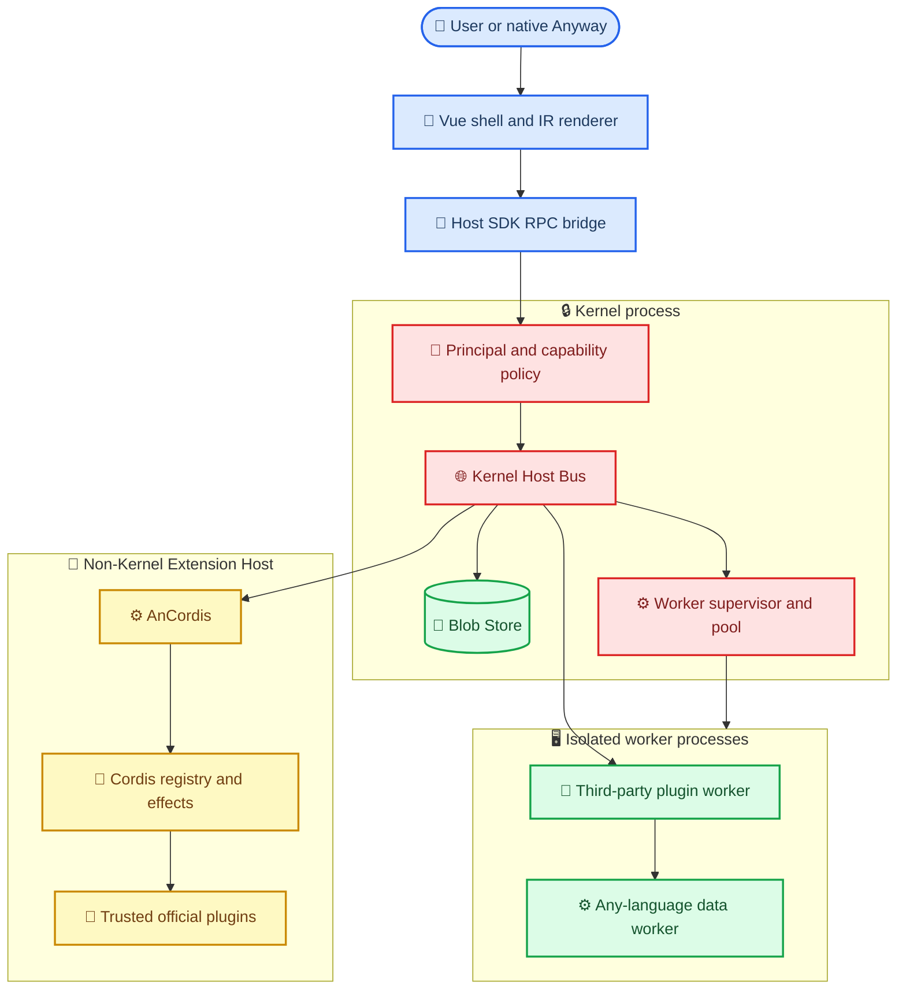
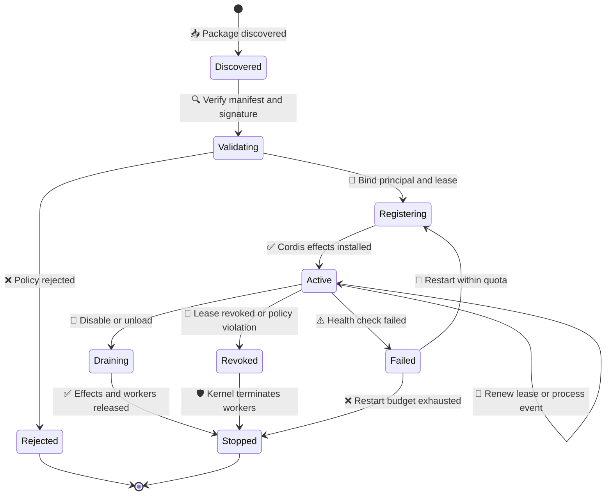
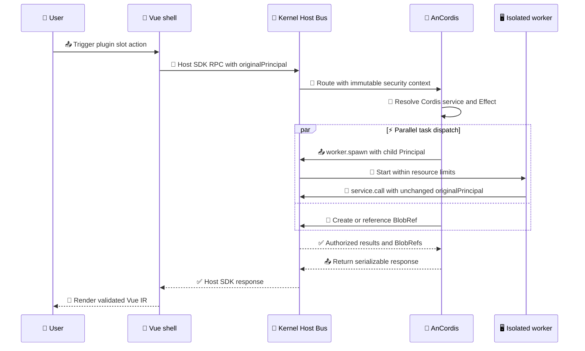

# AnCordis：Anyway 官方系统插件架构

_基于基线 `ae47fe6` 的 AnCordis、Kernel Host Bus、Blob、Vue IR 与 AnMarket 架构设计。_

---

## 🎯 目标与边界

AnCordis 是 Anyway 的官方 **非 Kernel Extension Host**。它把 Cordis 用作服务注册、依赖解析、事件订阅和可逆 Effect 的运行时；并通过 Kernel Host Bus 创建和管理并行 worker。AnCordis 不负责最终授权，也不构成安全边界。

本设计保留现有插件的声明式和 WASM 能力，同时增加一种面向服务型插件的协议。原生 Anyway 数据交互和插件数据交互都使用同一套 Host SDK/RPC 语义，但每个请求仍携带独立的 `Principal`、Capability 和租约。

本文件与 [`my-plugins/ancordis/protocol.ts`](../../my-plugins/ancordis/protocol.ts) 是协议草案，不代表基线已经接入新的运行时。当前实现仍以 [`plugins/README.md`](../../plugins/README.md) 描述的 MYC 包和 Rust WASM VM 为准。

> ⚠️ **安全边界：** Kernel 是唯一可信计算基。AnCordis 可以协调服务，不能替换 Kernel 的身份验证、Capability 授权、Blob 访问控制、进程监督、安装回滚或审计。

## 🏗️ 系统分层

下面的分层将组合性和安全性分开：Cordis 解决 Extension Host 内部的生命周期问题，Host Bus 解决跨组件的并行调度和数据交换，Kernel 解决不可绕过的安全策略。



### 组件职责

| 组件 | 责任 | 明确不负责 |
| --- | --- | --- |
| Kernel | Principal、Capability、租约、Blob、worker、审计 | Cordis 插件组合逻辑 |
| Host Bus | RPC 路由、并行调度、背压、取消、流式引用 | 业务服务实现 |
| AnCordis | 服务注册、依赖图、Effect 清理、事件订阅 | OS 安全隔离 |
| Cordis plugin | 业务服务和事件处理 | 修改 Kernel 策略 |
| Vue IR renderer | 校验并渲染白名单组件 | 执行插件 JavaScript |
| AnMarket | 目录、扫描、信誉和安装流程 UI | 修改信任根或直接安装 |

## 🔐 安全模型与 Principal

### 安全责任分界

Cordis 的 Context、服务注册和可逆 Effect 是**合作式运行时约束**。它们可以让正常插件在卸载时释放监听器、服务和任务，但不能阻止同进程 JavaScript 直接访问 Node API、修改全局状态或阻塞事件循环。Cordis 的事件系统确实将注册绑定到可回收的 Fiber/Effect 生命周期，但这一机制本身不是 OS 沙箱[^1][^2]。因此可信官方插件可以同进程运行，第三方插件必须进入独立进程。

AnCordis 自身也运行在非 Kernel 进程中。它如果被攻破，Kernel 仍必须能够拒绝越权请求、撤销租约、终止 worker 和回收 Blob。所有 Kernel 端的授权都必须重新验证，不能因为请求经过 AnCordis 就自动获得 AnCordis 的权限。

### 防止 confused deputy

请求中的四个身份概念必须分开：

| 字段 | 含义 | 可由 AnCordis 修改 |
| --- | --- | --- |
| `originalPrincipal` | 触发请求的用户、系统任务或原始插件 | 不可修改 |
| `immediateCaller` | 当前直接发送 RPC 的进程或插件 | 只能由 Kernel 重新绑定 |
| `delegationChain` | 经过的 Host 和插件链路 | 只能追加 |
| `capabilityGrants` | Kernel 签发的、带资源范围和过期时间的授权 | 不可增加或延长 |

子插件调用的安全规则如下：

1. Kernel 在入口创建不可变 `SecurityContext`
2. AnCordis 只能追加自己的 `PrincipalRef` 到 `delegationChain`
3. 子插件必须获得自己的 `worker` 或 `plugin` Principal
4. 子插件看到的 `originalPrincipal` 必须与父请求一致
5. Kernel 对每个服务调用重新检查 Principal、Capability、资源范围和租约
6. Capability 只能向下收窄，不能由 AnCordis 或子插件自授予

因此，AnCordis 可以代表用户编排任务，但不能把“AnCordis 有权限”错误地解释成“子插件有权限”。

### 双运行模式

| 模式 | 适用对象 | 进程边界 | 授权方式 |
| --- | --- | --- | --- |
| `trusted-in-process` | Anyway 签名的官方插件 | 与 AnCordis 共进程 | 官方信任 + 每次 Host Bus 调用仍由 Kernel 授权 |
| `isolated-process` | 第三方和未审计插件 | 每个插件独立 worker | 子 Principal + Host RPC + OS 资源配额 |

同进程模式只是性能和开发体验优化，不得被当作安全隔离。任何需要防御恶意代码的插件都必须使用 `isolated-process`。

## ⚙️ 线程池、worker 与并行调度

### 两层执行模型

Kernel 将执行分为两层：

- **Host Bus 调度层：** 负责请求排队、并发额度、deadline、取消、背压和结果路由
- **Worker 执行层：** 负责进程/线程生命周期、CPU 与内存配额、健康检查和强制终止

AnCordis 不创建不可监督的后台线程，也不把大数据塞进事件队列。它从 Cordis 事件处理器中识别可并行任务，调用 `worker.spawn` 获取受限 worker，再使用 `service.call` 或事件消息分发工作。

`serial`、`parallel` 和 `latest` 是事件投递语义，不是安全权限：

| 模式 | 语义 | 典型用途 |
| --- | --- | --- |
| `serial` | 同一订阅按顺序处理 | 状态机、顺序写入 |
| `parallel` | 独立事件可同时处理 | PDF 分片、供应链扫描 |
| `latest` | 丢弃过期中间值 | 进度、预览和搜索建议 |

每个 worker 都必须绑定 `workerPrincipal`、`RegistrationLease` 和资源限制。Worker 结束、租约过期、插件卸载或 Kernel 发现违规时，Kernel 负责停止并回收资源。Cordis 的可逆 Effect 负责释放 AnCordis 内部注册，不能替代 Kernel 的进程回收。

### 生命周期



生命周期中的不可绕过动作由 Kernel 执行：验证、Principal 绑定、租约签发、worker 启动、撤销和最终回收。Cordis 负责 `Registering → Active` 期间的依赖安装与 Effect 记录，并在 `Draining` 时执行可逆清理。

## 📡 Host Bus 与 inside RPC

### 统一交互语义

本文把 `inside RPC` 定义为 Kernel、AnCordis 和 worker 之间的内部 RPC。它可以在同进程中优化为内存队列，也可以在跨进程时使用受控 IPC；两种实现必须共享同一个可序列化 envelope、Principal 检查、错误码、deadline 和取消语义。直接函数调用只能是实现优化，不能成为插件协议。

Host Bus 的最小操作集是：

| 操作 | 作用 | 必须绑定 |
| --- | --- | --- |
| `service.register` | 注册可调用服务 | provider Principal、描述符、租约 |
| `lease.renew` | 延长注册有效期 | 原 lease、Principal、上限 |
| `event.subscribe` | 订阅 Host Bus 事件 | subscriber Principal、投递策略 |
| `service.call` | 调用服务方法 | 原始 Principal、Capability、Schema |
| `worker.spawn` | 创建并行 worker | 子 Principal、Blob、资源配额 |
| `worker.stop` | 优雅停止或强制终止 | worker lease、原因、宽限期 |

服务描述符必须是可序列化数据，不能包含函数、闭包、类实例或渲染器引用。`protocol.ts` 中的 `ServiceDescriptor` 使用 JSON Schema 引用描述方法输入输出，以便 Kernel 在路由前验证版本和大小。

### 典型调用交互



大 payload 不经过多层 JSON 复制：生产者把内容写入 BlobStore，RPC 只传 `BlobRef`。Kernel 仍会检查引用的 owner、scope、hash、大小和过期时间。

## 💾 Blob 数据平面

BlobStore 是 Host Bus 的数据平面，RPC 是控制平面。两者分开可以让原生 Anyway 数据和插件数据使用同一条安全路径，同时避免把 PDF、模型输入或扫描包复制到每个进程的 JSON 消息中。

### BlobRef 规则

- `blobId` 和 `sha256` 标识不可变内容
- `sizeBytes`、`mediaType` 和过期时间由 Kernel 记录并复核
- 插件只获得 `read` 或 `write-once` 引用，不获得任意文件路径
- 写入完成后，Kernel 冻结内容并校验 hash
- 引用通过租约或任务生命周期保持有效，释放后异步回收
- worker 需要访问数据时，通过 `blob.read` 获得受限句柄或范围读取结果

推荐的数据路径是：

```text
源文件 / 原生数据
    → Kernel BlobStore（hash、大小、权限）
    → BlobRef
    → Host Bus RPC（只传引用）
    → AnCordis / worker
    → 新 BlobRef 或小型 JSON 结果
```

Blob 不自动授予调用权限。拥有一个 `BlobRef` 只表示“可以请求访问这个已授权对象”，最终读取仍由 Kernel 校验 Principal 和 Capability。

## 🎨 Vue IR 与插件 UI

插件 UI 使用宿主拥有的 Vue IR。插件贡献 `VueIrNode`，宿主负责：

1. Rust 侧检查节点深度、节点数量、组件名、属性类型、事件名和 Blob 引用
2. Vue 侧只从组件白名单解析 `type`
3. 事件只映射为已声明的 Host SDK RPC 方法
4. 禁止任意 HTML、`v-html`、JavaScript 表达式、函数序列化、renderer callback 和 DOM 引用
5. 所有异步数据通过 RPC 或 BlobRef 回填，组件本身不持有插件进程对象

这允许开发者继续使用 Vue 的组件组合、响应式绑定和事件体验，但把可执行部分留在宿主的白名单渲染器中。`VueIrBinding` 只表达受限数据路径，不表达任意表达式。

一个贡献可以形如：

```json
{
  "contributionId": "anmarket.install-review",
  "pluginId": "anyway.system.anmarket",
  "slotId": "plugin-install.review.after-scan",
  "node": {
    "type": "Panel",
    "props": {
      "title": "Scan result"
    },
    "children": [
      {
        "type": "Badge",
        "props": {
          "tone": "warning",
          "text": {
            "kind": "binding",
            "path": "scan.summary.severity",
            "mode": "read"
          }
        }
      }
    ],
    "events": [
      {
        "event": "confirm",
        "method": "install.request",
        "payload": {
          "reviewRequired": true
        }
      }
    ]
  },
  "allowedEvents": ["confirm"]
}
```

上述 IR 没有 `template` 字符串、HTML 字符串或函数；即便第三方插件进程被攻破，也只能请求宿主允许的组件和方法。官方插件可以获得更完整的 IR 组件集合，但仍由 Rust 验证器和 Vue renderer 执行最终约束。

## 🔌 AnCordis 官方系统插件

AnCordis 的最小 manifest 和协议位于 [`my-plugins/ancordis/`](../../my-plugins/ancordis/)。Manifest 只描述设计期身份，不修改现有 `MycPluginManifest`；接入正式 SDK 前，Kernel 必须明确识别 `SystemExtension`，而不是让普通插件通过字段自称官方系统插件。

### Cordis 服务模型

AnCordis 内部的 Cordis adapter 提供三类对象：

| 对象 | 作用 | Kernel 对应物 |
| --- | --- | --- |
| Service descriptor | 描述服务方法和 Schema | `service.register` |
| Effect | 记录监听器、服务和任务的可逆清理 | registration lease / cancellation |
| Event subscription | 声明主题、过滤器和并行策略 | `event.subscribe` |

服务注册成功后得到 `RegistrationLease`。Lease 过期、插件卸载、依赖停止或策略撤销时，Kernel 先停止对外路由，再通知 AnCordis 清理 Effect；这样不会在清理过程中继续接收新的请求。

### 官方同进程插件

可信官方插件可以直接挂入 AnCordis 的 Cordis Context，以获得原生服务注册和依赖注入体验。但官方插件的长任务和大数据仍应转交 Host Bus worker/Blob 路径，避免阻塞 Extension Host 或把高权限对象传播给子插件。

### 第三方隔离插件

第三方插件不直接获得 Cordis Context。AnCordis 为它创建独立 Principal，通过 `worker.spawn` 启动进程，再把可用服务投影为序列化 RPC。插件可以使用 TypeScript、Rust、Go、Python、C++ 或其他语言，只要遵守 `protocol.ts` 的 JSON、Schema、BlobRef、错误码和 Principal 规则。

## 🛒 AnMarket 官方插件

AnMarket 是与 AnCordis 分离的官方系统插件，负责插件目录、版本检查、供应链扫描、权限审阅和安装 UI。它使用 AnCordis 的服务和 worker 编排能力，但不是信任根。

### AnMarket 能做什么

- 连接官方、企业和本地 registry
- 下载到 Kernel quarantine BlobStore
- 请求签名、hash、清单和依赖分析
- 调度并行静态扫描、SBOM、License 和信誉 provider
- 通过 Vue IR 展示权限差异、扫描结果和用户审批
- 观察更新、撤销和兼容性状态

### AnMarket 不能做什么

- 修改 Kernel 信任公钥或最低安全规则
- 在 quarantine 之外执行未批准的包
- 直接写入 installed 目录或替换当前版本
- 自行授予插件文件、网络、凭据或子进程权限
- 把扫描结果伪装成用户批准

安装流程必须由 Kernel 保留最终控制权：

```mermaid
flowchart LR
    accTitle: AnMarket Install Gate
    accDescr: AnMarket analyzes a quarantined package while the Kernel verifies signatures, applies policy, requires approval, and performs atomic activation or rejection

    package_blob([📦 Package Blob]) --> kernel_quarantine[🔒 Kernel quarantine]
    kernel_quarantine --> anmarket_scan[🔍 AnMarket parallel scans]
    anmarket_scan --> scan_report[📊 Signed scan report]
    scan_report --> kernel_policy[🔐 Kernel policy and approval]
    kernel_policy --> install_decision{Install allowed?}
    install_decision -->|Yes| atomic_activate[🚀 Atomic activate]
    install_decision -->|No| keep_quarantine[🛡️ Keep quarantined]

    classDef primary fill:#dbeafe,stroke:#2563eb,stroke-width:2px,color:#1e3a5f
    classDef boundary fill:#fee2e2,stroke:#dc2626,stroke-width:2px,color:#7f1d1d
    classDef extension fill:#fef9c3,stroke:#ca8a04,stroke-width:2px,color:#713f12
    classDef success fill:#dcfce7,stroke:#16a34a,stroke-width:2px,color:#14532d

    class package_blob,anmarket_scan,scan_report extension
    class kernel_quarantine,kernel_policy boundary
    class install_decision primary
    class atomic_activate success
    class keep_quarantine boundary
```



扫描插件可以建议拒绝或要求隔离，但不能单独批准安装。扫描报告必须绑定被分析包的 hash、分析器版本、规则版本、时间和 Principal，避免把一个包的结果复用于另一个包。

## 🧾 协议摘要

`protocol.ts` 是本设计的最小类型表面：

| 协议类型 | 关键字段 | 设计目的 |
| --- | --- | --- |
| `ServiceDescriptor` | 方法、Schema、Capability、执行模式 | 可序列化注册 |
| `RegistrationLease` | owner、resource、过期时间、generation | 可撤销生命周期 |
| `EventSubscriptionRequest` | topic、filter、delivery、maxInFlight | 声明式事件投递 |
| `WorkerSpawnRequest` | artifact、language、Principal、limits | 跨语言并行处理 |
| `WorkerStopRequest` | worker、reason、graceMs | 可观测停止和强制回收 |
| `BlobRef` | hash、大小、类型、访问方式 | 大数据零路径传递 |
| `SecurityContext` | original、caller、delegation、grants | 防止 confused deputy |
| `VueIrNode` | type、props、children、events | 无任意 HTML 的 Vue 扩展 |

协议演进必须保持：

- `apiVersion` 明确且可并行支持旧版本
- 新字段默认可忽略，安全字段默认拒绝
- Schema hash 与 payload hash 参与审计
- 任何请求都能关联 `requestId`、Principal、lease 和 trace
- 大数据只用 BlobRef，不把本地路径或 secret 放入 JSON
- 错误响应不泄露凭据、绝对路径或未授权资源内容

## 🧭 与当前基线的衔接

当前基线已经具备几块可复用基础：

| 基线能力 | AnCordis 接入方式 |
| --- | --- |
| Rust WASM VM 的无 host import 边界 | 保留为低权限、一次性计算模式 |
| 插件签名和 payload hash | 作为 AnMarket quarantine 的 Kernel 前置验证 |
| Host-mediated workspace capability | 映射为带 Principal 的 Host Bus service call |
| GraphPatch review gate | 作为第三方 worker 的只提案数据接口 |
| Host-owned secret settings | Vue IR 只能显示状态，不能读取明文 secret |
| 当前 Agent 串行 permit | 迁移到 Kernel scheduler 的 per-principal 配额，逐步开放并行 |

迁移期间，旧 MYC 插件和新 Extension Host 插件并存：旧插件继续通过现有加载器运行；AnCordis 只在 Kernel Host Bus、正式 SDK 和 Vue IR renderer 完成后成为可启动的系统插件。

## 🗺️ 实施阶段

1. **协议冻结：** 评审 `protocol.ts`、manifest 字段、错误码和 Principal 不变量
2. **Kernel Host Bus：** 实现 envelope 验证、Capability 重授权、lease registry、取消和审计
3. **BlobStore：** 实现不可变引用、hash 校验、范围读取、租约回收和配额
4. **Worker supervisor：** 把当前全局串行执行拆成受限的并行 worker pool，并保留停止/回滚路径
5. **AnCordis adapter：** 在非 Kernel Extension Host 中接入 Cordis service registry、Effect 和 event subscription
6. **Vue IR renderer：** 增加 Rust 验证与 Vue 白名单渲染，提供 `plugin` slot
7. **AnMarket：** 以独立官方插件实现 registry、扫描器、信誉 provider 和安装审阅
8. **迁移与压测：** 先迁移官方服务型插件，再验证第三方多语言 worker 的吞吐、背压、崩溃恢复和权限审计

本次骨架刻意不修改现有插件清单、SDK、Cargo 或前端文件，确保架构协议可以先独立评审。

## 🔗 参考资料

- [AnCordis protocol skeleton](../../my-plugins/ancordis/protocol.ts)
- [AnCordis manifest example](../../my-plugins/ancordis/manifest.json)
- [Current plugin packaging boundary](../../plugins/README.md)
- [Current plugin contracts](../../app/plugins/contracts.ts)
- [Current capability-free WASM VM](../../src-tauri/src/plugin_vm.rs)

[^1]: DeepSeek. (2026). "DeepSeek Harness architecture." https://github.com/deepseek-ai/deepseek-harness/blob/master/docs/architecture.md

[^2]: DeepSeek. (2026). "Cordis event dispatch and reversible registrations." https://github.com/deepseek-ai/deepseek-harness/blob/master/vendor/cordis/src/events.ts
