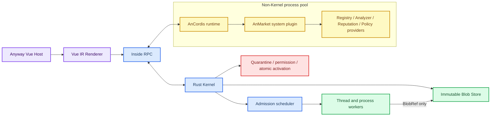
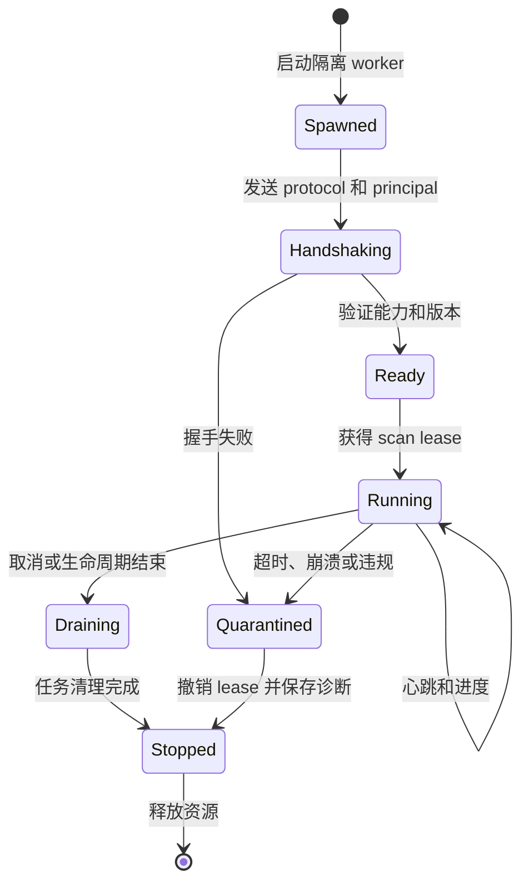
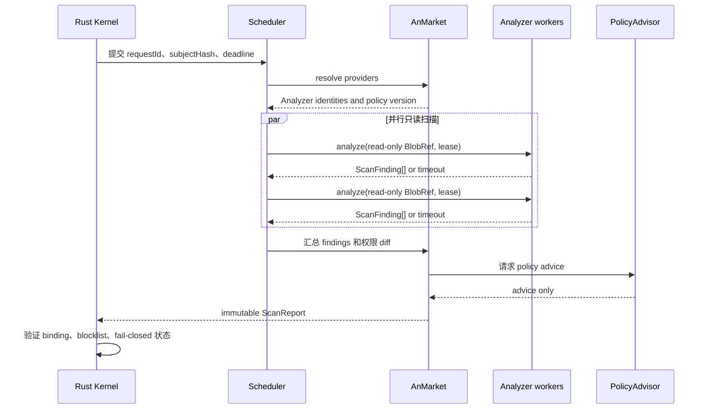
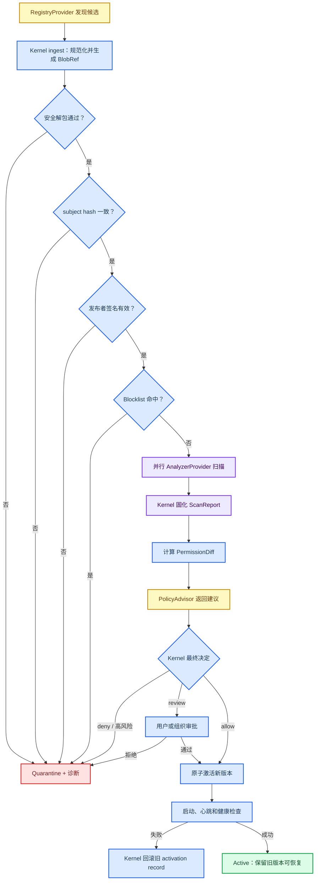

# AnMarket 供应链系统插件架构

_基于基线 `ae47fe6` 的 AnMarket 官方系统插件设计与最小契约骨架。_

---

> **状态：** 本文和 `plugins/system/anmarket/` 是设计级最小骨架。它不修改现有安装器、签名实现、插件契约、Cargo 或前端；`SystemPlugin` 需要后续 Kernel 迭代后才会成为可执行插件。

## 📋 设计边界

AnMarket 是 Anyway 官方供应链插件，运行在非 Kernel 的 AnCordis 进程池中。它负责把仓库、扫描器、信誉源、策略建议器和 AnMarket Vue IR 组织成一个可替换的供应链控制面；Rust Kernel 负责不可绕过的安全判定和状态提交。

| 能力 | 是否可插件化 | 最终控制者 |
| --- | --- | --- |
| RegistryProvider 仓库连接 | 是 | AnMarket 编排，Kernel 校验结果 |
| AnalyzerProvider 扫描器 | 是 | AnMarket 编排，Kernel 限制输入和资源 |
| ReputationProvider 信誉/Blocklist 源 | 是 | AnMarket 获取，Kernel 验签和落库 |
| PolicyAdvisor 策略建议 | 是 | AnMarket 提议，Kernel 强制最低规则 |
| Vue IR 页面和组件 | 是 | Vue Host 白名单渲染器 |
| 信任根 | 否 | Kernel 固定配置/受保护更新流程 |
| 包和报告哈希 | 否 | Kernel Blob Store 与报告提交路径 |
| 发布者签名验证 | 否 | Kernel |
| 隔离安装与解包 | 否 | Kernel |
| 权限授予 | 否 | Kernel capability gate |
| 原子激活、回滚和审计 | 否 | Kernel |

核心规则是：**供应链策略、扫描、仓库和 UI 可以替换；信任根、内容绑定和执行授权不能由插件替换。** AnMarket 不能批准自己，`PolicyAdvisor` 也只能返回建议，不能直接扩大权限或调用安装接口。

## 🏗️ 系统总览



### 组件职责

| 组件 | 主要职责 | 不允许做什么 |
| --- | --- | --- |
| Rust Kernel | 身份、能力、Blob、进程、调度、安装和激活 | 不把策略细节写死在 AnMarket 之外的普通插件中 |
| Host Bus / Inside RPC | 统一原生和插件的数据交互协议 | 不接受无 principal 的调用 |
| AnCordis | Provider 注册、依赖、生命周期、编排 | 不充当安全边界，不代理隐式高权限 |
| AnMarket | 仓库、扫描、信誉、策略和市场 UI 编排 | 不改信任根，不直接安装或授予权限 |
| Worker pool | 并行扫描和解析 | 不持有 Kernel 可变状态，不接收路径句柄 |
| Blob Store | 不可变包、报告和证据存储 | 不向插件暴露任意文件系统路径 |
| Vue Host | 以 Vue IR 渲染受控组件 | 不执行插件 HTML/JS，不让插件操作 DOM |

## 🔐 信任和权限模型

### Kernel 强制项

这些规则必须在 Kernel 的入口处执行，不能只在 AnMarket 或 Vue UI 中检查：

- **信任根：** 维护受保护的 publisher key 和 blocklist feed key；AnMarket 不能修改自身的信任源。
- **subject hash：** Kernel 对规范化 manifest 和包内容计算 subject hash，并把后续报告、审批、安装和激活绑定到该 hash。
- **签名：** Kernel 验证发布者签名、feed 签名和内部报告完整性；签名通过不等于内容安全。
- **隔离安装：** 包先进入 quarantine，完成安全解包、路径穿越检查、大小/压缩比限制和扫描后才能进入可激活状态。
- **权限授予：** manifest 声明只是请求；实际 capability lease 由 Kernel 根据策略、用户审批、版本和 principal 颁发。
- **原子激活：** 新版本以事务形式切换，失败时保留旧版本并恢复旧 activation record。

AnMarket 能力只代表“可以提出供应链操作”，不代表获得了文件、网络、进程或安装权限。尤其是 `AnalyzerProvider` 不能接收本地路径、可写 Blob、凭据、workspace store 或 `plugin.install` 方法。

### Principal 不可透传升级

每个 AnCordis 进程、Provider、扫描任务和 Vue action 都带独立 principal。AnMarket 转发请求时必须保留原始 Provider principal，不能把第三方 Provider 伪装成 `anyway.anmarket`。Kernel 的授权判断使用：

```text
(principal, capability, subjectHash, requestId, deadline, policyVersion)
```

而不是只使用插件 ID。AnMarket 的官方身份只授予它编排能力，不自动授予它代表其他 Provider 执行安装的能力。

## 🧩 Provider 契约

无依赖 TypeScript 契约位于 [`plugins/system/anmarket/types.ts`](../../plugins/system/anmarket/types.ts)，入口位于 [`plugins/system/anmarket/index.ts`](../../plugins/system/anmarket/index.ts)。Provider 接口按“输入不可变、输出可审计、权限不可隐式扩张”设计。

| Provider | 输入 | 输出 | 允许的副作用 |
| --- | --- | --- | --- |
| `RegistryProvider` | 查询或候选版本 | `RegistryCandidate`、带 `BlobRef` 的 `RegistryArtifact` | 通过受限网络获取内容；不能激活 |
| `AnalyzerProvider` | `SubjectRef`、只读 `BlobRef`、权限请求 | `ScanFinding[]` | 只读 Blob；不能写包、批准或安装 |
| `ReputationProvider` | subject hash、publisher key | 信誉评估、签名 blocklist feed | 读取远端信誉；不能改 Kernel blocklist |
| `PolicyAdvisor` | `ScanReport`、`PermissionDiff` | `PolicyAdvice` | 生成建议；不能授予权限 |

### RegistryProvider

`RegistryProvider.search()` 返回候选元数据，`fetch()` 返回已经被 Kernel 物化为 `BlobRef` 的 manifest 和 artifact。Provider 不返回本地路径，也不把远端响应直接标记为已可信。

仓库可以来自官方市场、Git、企业内网或离线文件，但它们都必须汇聚到同一个 Kernel ingest 路径：规范化、哈希、签名校验、隔离和扫描不能由 RegistryProvider 自行替代。

### AnalyzerProvider

分析器的唯一数据入口是 `SubjectRef` 中的只读 `BlobRef`。需要读取内容时，分析器通过只读 `blobRead` RPC 以有界 range 拉取数据；返回数据按块计费并受超时、内存、CPU、输出大小和并发配额限制。

分析器输出 `ScanFinding`，每条 finding 至少包含严重级别、类别、规则 ID、消息、置信度和可选位置/证据哈希。分析器不得：

- 直接访问工作区或操作系统路径
- 创建可写 Blob 或修改原始 subject
- 读取凭据和环境秘密
- 调用安装、激活、回滚或权限授予 RPC
- 把自己的分析结果标记为批准

### ReputationProvider 和签名 blocklist feed

信誉源返回 `unknown/trusted/review/blocked` 等信号，但信誉结果本身不能跳过 Kernel 的最低安全规则。Blocklist feed 包含 `feedId`、单调递增版本、有效期、签名者 key ID、payload hash 和 entries；Kernel 验证签名、有效期和版本回退，才把 feed 纳入决策输入。

过期、重复、签名错误或版本倒退的 feed 进入诊断状态，不覆盖当前有效 feed。若 feed 明确阻断 subject hash、publisher key 或 plugin ID，Kernel 至少将其置于 quarantine；AnMarket 不能通过换一个 ReputationProvider 清除该阻断。

### PolicyAdvisor

策略建议器接收完整 `ScanReport` 和权限差异，返回 `allow/review/quarantine/deny` 建议、原因和所需审批人。Kernel 可以把建议升级为更严格的决定，但不能因为建议器返回 `allow` 就跳过签名、blocklist、权限和用户审批规则。

## 📊 Finding、Report 和权限差异

### ScanFinding

`ScanFinding` 是单个分析器的可审计证据，不是安装决定。它的关键字段如下：

| 字段 | 约束 |
| --- | --- |
| `findingId` | 在一次扫描报告中稳定且唯一 |
| `severity` | `info`、`low`、`medium`、`high`、`critical` |
| `category` | malware、vulnerability、integrity、license、policy 或 quality |
| `ruleId` | 分析器规则标识，用于复现和豁免审计 |
| `confidence` | `0` 到 `1` 的分析器置信度，不直接等于策略结论 |
| `evidenceHash` | 可选证据绑定，不能用可变路径代替 |

### ScanReport 绑定

每个 `ScanReport` 必须绑定以下内容：

```text
reportHash = hash(
  reportVersion,
  requestId,
  subject.pluginId,
  subject.version,
  subject.subjectHash,
  analyzers[id, version, publisherKeyId, invocationId],
  policyVersion,
  permissionDiff,
  findings,
  reputation,
  blocklistVersions
)
```

其中 `subjectHash` 防止“扫描 A 包、安装 B 包”，`analyzers` 的身份和版本防止扫描器替换后仍复用旧报告，`policyVersion` 防止旧策略报告被误当作新策略结果。报告进入 Kernel 后不可变；策略升级时必须重新评估或明确标记为 stale。

### PermissionDiff

更新安装不能只比较版本号。Kernel 根据当前已激活版本和候选版本生成 `PermissionDiff`，至少包含 `added`、`removed`、`changed` 和 `unchanged`：

- 新增 `network.request`、`process.spawn` 或 `workspace.write` 默认进入 review。
- 删除权限不需要扩大批准范围，但仍要记录以便回滚和审计。
- 同名权限的参数、目标范围或数据分类变化属于 `changed`，不能只看字符串是否相同。
- 可选权限不应在未发生显式用户操作时自动升级为已授予权限。

## ⚙️ Kernel 调度、线程池和生命周期

### 控制面与数据面分离

Cordis 是 AnMarket 的控制面：负责 Provider 注册、依赖解析、事件订阅和可逆生命周期。扫描数据面由 Kernel scheduler 负责，避免 Cordis 的串行生命周期模型把所有扫描排成单队列。

Kernel 至少划分三类调度资源：

| 队列 | 典型任务 | 隔离策略 |
| --- | --- | --- |
| `io` | Registry 下载、Blob 分块读取 | 网络/磁盘配额，取消传播 |
| `cpu` | 清单解析、哈希、静态分析 | 线程池、CPU 配额、最大运行时间 |
| `process` | 不同语言 Provider、动态沙箱 | 独立进程、心跳、内存/进程数上限 |

每个任务带 `requestId`、principal、subject hash、deadline 和 capability lease。线程池可以并行执行互不依赖的 AnalyzerProvider；同一个 Provider 的并发度、每个插件的总并发度以及全局扫描并发度都由 Kernel 限制。

### Worker 生命周期



超时、心跳丢失、协议违规、内存/CPU 超额或输出校验失败都采用 **fail-closed**：任务标记为 incomplete，subject 保持 quarantine，不因为部分扫描结果而激活。普通 Provider 的异常只能影响自己的 worker 和当前扫描请求；Kernel 进程监督器不能把异常 Provider 的状态写入其他 principal。

### 并行扫描交互



大文件和证据通过 `BlobRef` 引用，不嵌入 Inside RPC JSON；小型控制消息才走 JSON。这样并行度增加时，IPC 消耗主要是有界的控制消息和 Blob 分块读取，而不是复制整个包到每个分析器。

## 📦 安装和更新供应链流程



### 安装阶段的不可绕过规则

1. **发现不等于信任。** `RegistryProvider` 可以返回候选，但候选只能进入 Kernel ingest。
2. **哈希先于扫描绑定。** 扫描输入、报告 subject 和安装对象必须使用同一个 subject hash。
3. **签名和扫描是不同条件。** 签名证明发布者/内容绑定，扫描和信誉用于风险判定，两者不能互相替代。
4. **高风险默认隔离。** `critical/high`、blocklist 命中、分析超时、报告不完整或权限扩大且未审批时保持 quarantine。
5. **激活是单次提交。** Kernel 在同一事务中写入 verified package、permission grant、activation record 和审计事件；任一项失败都不切换活动版本。
6. **更新保留旧版本。** 新版本启动失败、心跳超时或健康检查失败时，Kernel 恢复旧 activation record，撤销新版本 lease，并把新版本保持在 quarantine/diagnostic 状态。

### 签名 blocklist feed

AnMarket 可以通过 `ReputationProvider.fetchBlocklist()` 获取 feed，但 Kernel 必须执行：

- 验证专用 feed signer key，不接受 Provider 自报可信
- 验证 payload hash、签名、版本单调性和有效期
- 只追加或替换经过验证的 immutable feed record
- 对 feed 更新写审计事件
- feed 拉取失败时保留最后一个未过期有效 feed
- feed 过期或签名异常时不自动清空已有阻断

## 🔌 Inside RPC 和 Blob 规则

Inside RPC 是原生功能和插件功能共用的 Host SDK 数据通道。它不是“插件可以调用的万能函数表”，每个 envelope 必须带 `protocol`、`requestId`、`principal`、`method`、`deadlineAt`、JSON `payload` 和可选 `blobRefs`。

建议的 Kernel 方法面如下：

| 方法 | 调用方 | 约束 |
| --- | --- | --- |
| `blob.read` | Analyzer worker | 只读、有界 range、不能返回路径 |
| `anmarket.scan.start` | AnMarket | Kernel 重新验证 subject 和 analyzer lease |
| `anmarket.report.get` | Vue Host / AnMarket | 只读 immutable report |
| `anmarket.install.request` | Vue Host | 只能创建待审核请求，不能直接激活 |
| `anmarket.update.rollback` | Kernel policy / 授权 UI | 只能回滚已记录的 activation |
| `anmarket.blocklist.submit` | ReputationProvider | 只接收待验证 feed，Kernel 验签后才生效 |

Blob Store 只产生不可变 `BlobRef`，引用至少包含 `digest`、`size`、`mediaType`、`store`、`access` 和 `retention`。BlobRef 是数据访问能力的载体，但不是文件路径；Kernel 仍需按 principal、subject、lease 和 deadline 检查每次读取。

## 🎨 Vue IR 安全边界

AnMarket 的设置、仓库列表、权限 diff、扫描报告和更新历史通过 Vue IR 提供。Vue Host 只接受白名单组件和 JSON 值，禁止插件提供任意 HTML 或 JavaScript。

允许的最小组件集合在 [`types.ts`](../../plugins/system/anmarket/types.ts) 中声明：

- `anmarket.registry-list`
- `anmarket.install-card`
- `anmarket.permission-diff`
- `anmarket.scan-report`
- `anmarket.finding-list`
- `anmarket.update-history`

组件 action 只能映射到固定命令 ID，例如 `anmarket.install.request` 或 `anmarket.update.rollback`。Vue Host 在渲染前验证 schema、component、slot、props 和 bindings；事件触发时由 Host RPC 重新带上 principal 和 capability lease。IR 不包含：

- `v-html` 或 raw HTML 字段
- 动态组件名和动态 import
- 任意脚本、函数体或 renderer callback
- 直接的 DOM、文件、Blob 写入或 workspace store 引用

这样 AnMarket 可以保留 Vue 的组合体验，同时把插件 UI 限制在 Host 维护的组件注册表内。

## 🧱 最小骨架和后续实现边界

当前骨架只有三类内容：

| 文件 | 内容 |
| --- | --- |
| [`plugin.yml`](../../plugins/system/anmarket/plugin.yml) | `SystemPlugin` manifest 示例、官方信任类别、Provider 和 Vue IR contributions |
| [`types.ts`](../../plugins/system/anmarket/types.ts) | Provider、BlobRef、RPC、finding/report、权限差异、blocklist、Vue IR 类型 |
| [`index.ts`](../../plugins/system/anmarket/index.ts) | 无依赖的类型导出入口 |

后续实现必须分阶段落在 Kernel 和 AnCordis 边界：

1. Kernel 先提供 immutable Blob、principal、capability lease、quarantine 和 activation transaction。
2. Kernel scheduler 再提供带 deadline、取消、配额和 worker supervision 的并行 scan job。
3. AnCordis 注册 Provider，并将其生命周期 effect 映射到 worker lease 的撤销。
4. Vue Host 增加 AnMarket IR slot 和固定命令解析；IR 只读展示报告。
5. 最后接入 RegistryProvider、AnalyzerProvider、ReputationProvider 和 PolicyAdvisor 的真实实现。

在这些 Kernel 入口完成前，AnMarket 只能作为契约和设计骨架存在，不能通过修改 manifest 绕过现有插件系统的安全边界。
