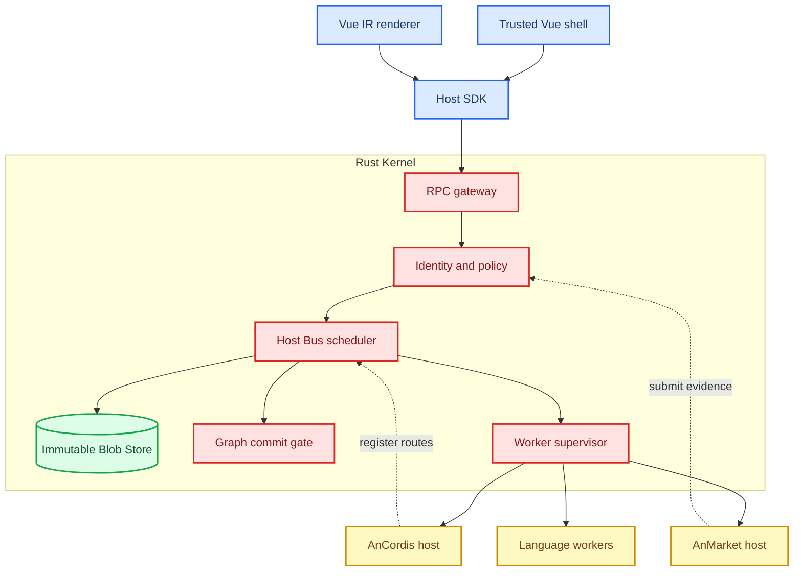

# Anyway Kernel Host architecture

_Target architecture for a safe, parallel, language-neutral plugin platform with native Vue integration._

---

## 📋 Outcome

Anyway becomes a small privileged Rust kernel surrounded by replaceable extension hosts and workers. The kernel owns identity, authorization, scheduling, bulk-data references, package activation, graph commits, and audit. Everything else can evolve as an extension without gaining the ability to bypass those controls.

The central design rule is:

> One Host SDK and one RPC vocabulary, but a distinct principal, capability set, quota, and audit trail for every caller.

This replaces the current flat collection of Tauri commands with a versioned kernel gateway. Existing commands remain as compatibility adapters during migration.



## 🔐 Security boundary

### Kernel-owned and non-replaceable

The following operations MUST remain in Rust and MUST NOT be replaced by AnCordis services or ordinary plugins:

- Principal creation and delegation
- Capability grants, leases, attenuation, expiry, and revocation
- RPC authentication, routing authorization, deadlines, cancellation, and quotas
- Blob hashing, scope checks, read leases, retention, and garbage collection
- Package canonicalization, payload hashing, signature verification, trust roots, quarantine, atomic activation, rollback, and revocation
- Worker process creation, OS sandbox policy, resource limits, health checks, termination, and restart accounting
- Graph revision validation, schema validation, review state, and final commit
- Security audit records and monotonic sequence assignment

Security-sensitive extension output is evidence, never authority. An analyzer can recommend denial; it cannot grant itself installation or capabilities.

### Extension-owned and replaceable

Extensions MAY own:

- Service discovery and composition
- Model providers and data processors
- Marketplace registries and search
- Malware, dependency, license, and reputation analyzers
- Importers, exporters, renderers, and workflows
- Declarative UI contributions
- Policy advice above the kernel minimum

### Principal preservation

Every request carries the original caller `PrincipalId`. If AnCordis forwards a request from plugin A to service B, the kernel authorizes the call as plugin A with an explicit delegation chain. AnCordis's official identity MUST NOT replace the child identity.

A child worker receives attenuated, expiring leases. It cannot mint a new principal, widen a capability, transfer a non-transferable lease, or act after its owner stops.

## ⚙️ Host Bus and parallel execution

The Host Bus is a kernel-owned router and scheduler, not a global lock. It separates workload classes so one plugin cannot monopolize unrelated work.

| Workload class | Typical work | Execution domain | Default policy |
| --- | --- | --- | --- |
| UI control | settings, status, commands | async kernel tasks | low latency, bounded fan-out |
| I/O | files, network, Blob reads | async runtime | per-principal concurrency |
| CPU | parsing, graph analysis | bounded blocking pool | weighted fair queue |
| WASM | pure plugin transforms | fuel-limited runtime pool | no host imports by default |
| Process | Python, Go, Node, native tools | supervised process pool | OS sandbox and hard quotas |
| Commit | GraphPatch and package activation | single writer per resource | revision checked |

The current global asynchronous mutex in `AgentHostState` is a migration source, not the target scheduler. It serializes all document jobs even when their files and model requests are independent. The replacement uses per-resource commit serialization and bounded parallel computation.

Thread pools and process workers share lifecycle vocabulary but not a fault boundary. A panic in a Rust task is handled inside the application process; an untrusted native worker MUST run out of process so it can be terminated independently.

### Scheduling requirements

- Every queue entry has a principal, workload class, cost estimate, deadline, cancellation token, and trace ID.
- Each principal has concurrency, CPU, memory, Blob, network, and output quotas.
- Interactive traffic has bounded priority but cannot starve background work indefinitely.
- Cancellation propagates from the initiating UI action through RPC, worker tasks, streams, and Blob upload leases.
- Backpressure is explicit; unbounded channels are forbidden on plugin-controlled paths.
- Restarts use a bounded policy with jitter and a circuit breaker. Security violations never auto-restart without policy review.

## 💾 Blob data plane

Large input and output MUST NOT be serialized repeatedly through JSON RPC. The caller uploads bytes once and receives a content-addressed immutable `BlobRef`.

```text
BlobRef {
  algorithm,
  digest,
  size,
  mediaType,
  scope,
  owner,
  createdAt,
  retentionClass
}
```

The digest identifies content; authorization is separate. Possessing a digest alone does not grant access. The kernel validates the caller, scope, lease, size, media type, and purpose every time it resolves a reference.

Small control messages MAY remain inline. The initial threshold is a policy setting rather than a protocol constant; callers must support receiving a Blob requirement response when inline data exceeds the active limit.

The Blob Store enables low-copy local transports later, including memory mapping or OS-assisted file transfer, without changing plugin RPC contracts.

## 🌐 Inside RPC

Inside RPC is the shared local protocol used by the Vue application adapter, AnCordis, AnMarket, and language workers. It is transport-neutral: in-process channels, named pipes, Unix sockets, and supervised stdio can carry the same envelope.

Every envelope includes:

- Protocol and schema version
- Request and parent request IDs
- Original caller principal and delegation chain
- Target service and operation
- Capability lease references
- Deadline and cancellation identity
- Trace and audit context
- Inline payload or Blob references

The kernel authenticates the transport endpoint and ignores caller-supplied identity that does not match the bound session. Frontend code cannot claim a plugin ID, and a worker cannot claim the kernel principal.

Calls to a registered service take the shortest authorized path: caller to kernel router to service worker. AnCordis participates in registration and lifecycle but is not a mandatory data proxy after routing is established.

## 🎨 Vue UI IR

Anyway preserves native Vue development through two explicit trust lanes.

### Trusted native lane

Built-in UI and separately audited official bundles MAY use ordinary Vue SFCs, Composition API, slots, transitions, and native application services. These artifacts ship with the application or are activated only under a kernel-owned official trust policy.

### Untrusted IR lane

Community plugins and language-neutral workers submit versioned UI IR. The authoring SDK MAY provide Vue-like templates and composables that compile to IR, but runtime output contains only data:

- Allowlisted component kinds
- Allowlisted props and bounded text
- Declarative layout
- Named state bindings
- Named action bindings
- Host-issued resource references

The IR MUST reject raw HTML, script, arbitrary component names, dynamic imports, JavaScript expressions, event functions, CSS strings, URL schemes outside policy, and prototype-bearing objects.

Validation occurs twice: Rust validates the canonical schema and security limits before returning IR to the frontend; Vue validates the same version and limits before rendering. The renderer maps IR kinds to a static component allowlist.

Reserved host locations use a contract similar to:

```vue
<PluginSlot type="node-inspector" :bind="selectionBinding" />
```

Plugins register a contribution for a known slot. They do not receive a Vue component constructor. Actions call the Host SDK with structured parameters, and the kernel reauthorizes them under the plugin principal.

## 🔌 AnCordis system extension

AnCordis is an official, supervised, non-kernel Extension Host. Its responsibilities are:

- Cordis service composition and dependency activation
- Typed event vocabulary
- Reversible registrations mapped to kernel leases
- Plugin configuration and lifecycle coordination
- Language worker registration
- Development diagnostics

Cordis serial and waterfall events are suitable for ordered control decisions. Compute-heavy and bulk-data work is submitted to the Host Bus and may execute in parallel. Cordis objects never cross the RPC boundary; only serializable service descriptors, event messages, and Blob references do.

Trusted official Cordis plugins MAY share the AnCordis process for full framework semantics. Third-party plugins use isolated workers and receive a serializable subset of the service model. Both modes retain child principals.

## 📦 AnMarket system extension

AnMarket is an official supply-chain and marketplace extension. It can register:

- Registry providers
- Analyzer providers
- Reputation providers
- Policy advisors
- Signed blocklist feed providers
- Marketplace UI contributions

AnMarket cannot install a package directly. A candidate becomes an immutable Blob, enters kernel quarantine, passes mandatory static validation, and is offered read-only to analyzers. Reports bind the exact subject digest, analyzer identity and version, policy revision, and timestamp.

The kernel combines mandatory checks, signed evidence, enterprise policy, user permission approval, and runtime compatibility before atomic activation. Unknown high-risk packages fail closed. Updates retain a last-known-good version and show capability and permission diffs before activation.

## 📊 Graph and state writes

Plugins do not write application state directly. They return one of:

- A value with no durable effect
- An immutable BlobRef
- A versioned proposal such as `GraphPatch`
- A declarative UI contribution
- A request for a named kernel capability

`GraphPatch` remains the only plugin-facing graph mutation vocabulary. It includes a base revision, provenance, operation limits, and review requirement. The kernel validates and stages the patch; the user or trusted policy accepts it; one resource-scoped writer commits it.

This preserves parallel extraction and analysis while avoiding concurrent graph corruption.

## 🔍 Current code mapping

| Current location | Current role | Target |
| --- | --- | --- |
| `src-tauri/src/lib.rs` | Flat Tauri command registration | Thin frontend adapter into Kernel RPC |
| `src-tauri/src/agent_commands.rs` | Agent orchestration and global serial permit | Host Bus jobs and per-resource commit gates |
| `src-tauri/src/agent_host.rs` | PDF job state and checkpoints | Domain worker behind generic lifecycle |
| `src-tauri/src/plugins.rs` | Manifest, installation, settings, execution | Package Trust, AnMarket evidence, runtime adapters |
| `src-tauri/src/plugin_vm.rs` | One-shot zero-import WASM VM | WASM worker provider under supervisor |
| `app/plugins/contracts.ts` | Frontend/plugin manifests and calls | Generated Host SDK compatibility layer |
| `src/vue/runtime/plugin-host.ts` | Vue plugin state façade | Host SDK session plus Vue IR contribution registry |

Two existing behaviors require explicit migration decisions:

- Manifest capability declarations are currently checked as if they were grants. The new kernel separates requested, granted, leased, and active capabilities.
- Unsigned plugins currently remain installable. The new package policy records them as untrusted candidates and decides quarantine or development-mode activation explicitly.

## ✅ Architecture invariants

1. No plugin-controlled byte stream is trusted before schema, size, and scope validation.
2. No proxy replaces the original caller identity.
3. No extension can grant itself a capability or activate its own package.
4. No bulk data crosses repeated JSON serialization boundaries.
5. No plugin UI can inject raw HTML, code, arbitrary Vue components, or event handlers.
6. No worker outlives its owner leases after stop, crash, uninstall, or revocation.
7. No graph or package state change commits without a revision-checked kernel gate.
8. No unbounded queue is reachable by an extension principal.
9. No security-sensitive service is replaceable through Cordis registration.
10. Every denied or state-changing operation has an auditable principal and trace.
