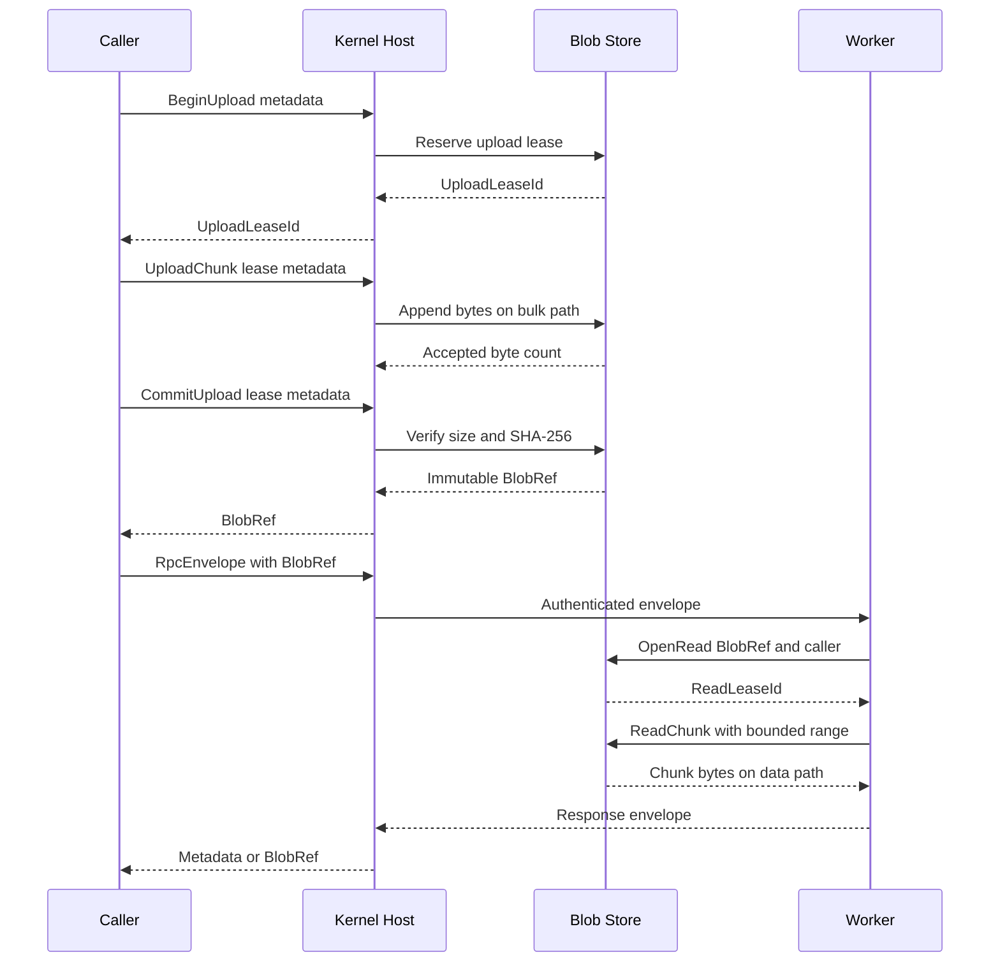

# Anyway Blob Store 与 Inside RPC

_第一阶段契约：基于 `d666b28` 的 Kernel identity，范围是 Blob 数据平面与本地 RPC 控制平面。_

---

## 🎯 设计结论

第一阶段把大数据和控制消息分成两条路径：

- `BlobStore` 负责内容寻址、不可变数据、作用域、上传/读取租约、配额和清理
- `Inside RPC` 负责小型 JSON/MessagePack 元数据、身份、能力租约、截止时间、追踪、流状态和背压
- `PrincipalId` 与 `CapabilityLease` 只来自 `kernel::identity`，RPC 不复制权限模型
- `AnCordis`、`AnMarket`、Vue IR 和语言工作进程都通过同一个 Host SDK 入口接入，但每个调用保留原始 caller principal
- 本阶段是纯 Rust 状态骨架；实际线程池、IPC transport、`kernel::mod` 导出和 Tauri 接线留给主线接入

核心边界如下：

> **BlobRef 是数据引用，不是权限。** 持有 digest 不能直接读取数据；每次打开读取租约仍须通过 caller、作用域、能力租约和有效期检查。

## 🔗 Blob 与 Inside RPC 时序

下面的时序表示一次完整的“上传一次、通过引用调用、按租约读取”流程。上传块可以走本地数据通道或 transport 的 bulk channel；它不进入 JSON/MessagePack `RpcEnvelope` 的内联 payload。



## 💾 Blob 数据平面

### BlobRef 结构

`BlobRef` 在 [blob.rs](../../src-tauri/src/kernel/blob.rs) 中是不可变结构。字段没有公开写入路径，外部只能通过构造校验和只读 getter 获得元数据。

| 字段 | 类型 | 约束 |
| --- | --- | --- |
| `digest` | `BlobDigest` | 对完整内容计算 SHA-256；是存储主键 |
| `size` | `u64` | 必须等于提交时接收的字节数 |
| `media_type` | `String` | 非空、无控制字符、长度受限 |
| `scope` | `BlobScope` | `Shared`、`Workspace` 或 `Private(principal)` |

digest 只代表内容。相同字节和相同媒体类型可以在不同作用域生成不同的 `BlobRef`，底层存储仍然去重；作用域不被 digest 替代，也不会因为去重而扩大访问权。

### 租约状态与接口

| 阶段 | 入口 | 状态校验与结果 |
| --- | --- | --- |
| 上传准备 | `begin_upload` | 校验 owner、scope、媒体类型、单 blob 上限、活跃租约数和 inflight 预留；返回 `UploadLeaseId` |
| 上传块 | `upload_chunk` | 必须提供相同 owner；累计大小不得超过 expected size；块仍走数据路径 |
| 提交 | `commit_upload` | 必须提供相同 owner；大小必须精确匹配；计算 SHA-256；新内容写入一次，重复内容去重；返回 `BlobRef` |
| 中止/过期 | `abort_upload` 或 `sweep` | 释放 expected size 的 inflight 预留；过期租约不能继续写入或提交 |
| 读取准备 | `open_read` | 校验 BlobRef 的 digest、size、media type、scope 和 caller；返回 `ReadLeaseId` |
| 读取块 | `read_chunk` | 必须提供同一 caller；租约过期、Blob 不存在或 range 越界时拒绝 |
| 读取结束 | `close_read` 或 `sweep` | 释放读取 pin；关闭后不能再次读取 |

第一阶段的内存后端使用 `Vec<u8>` 返回读取块，目的是固定状态语义。生产后端可以把同一契约映射到文件、内存映射或操作系统 bulk channel，而不改变 `BlobRef` 和租约接口。

### 配额与清理

`BlobQuota` 同时约束持久内容和临时上传：

| 配额 | 语义 |
| --- | --- |
| `max_stored_bytes` | 已提交、去重后的总内容大小 |
| `max_blob_bytes` | 单个 Blob 的最大 expected size |
| `max_inflight_bytes` | 所有未提交上传按 expected size 预留的总量 |
| `max_active_uploads` | 未提交上传租约数 |
| `max_read_leases` | 活跃读取租约数 |
| `max_read_lease_ttl_ms` | 单个读取租约允许的最长 TTL |

在 `begin_upload` 时预留 expected size，避免多个并行上传同时通过检查后超卖内存。提交重复 digest 时不增加 `max_stored_bytes`，但仍须验证已存内容的 size 和 media type 一致。

`sweep(now_ms, idle_after_ms)` 按以下顺序执行：

1. 删除过期上传租约并释放 inflight 预留
2. 删除过期读取租约
3. 收集仍被读取租约 pin 的 digest
4. 仅删除没有 pin 且达到 idle 阈值的已提交 Blob

提交不是永久保留保证。需要跨越清理周期的调用必须保持读取租约；后续持久化实现可以在同一模型上增加 kernel-owned retention lease，但不能把 digest 本身当作 retention 权限。

## 🌐 Inside RPC 契约

`RpcEnvelope` 位于 [rpc.rs](../../src-tauri/src/kernel/rpc.rs)，所有字段在请求、响应、取消和窗口更新中都保留。caller 和能力租约来自 [identity.rs](../../src-tauri/src/kernel/identity.rs)，没有 RPC 私有的身份副本。

| 字段 | 类型 | 作用 |
| --- | --- | --- |
| `request_id` | `RequestId` | 非零、全局相关性标识 |
| `caller` | `PrincipalId` | 原始调用者；代理转发时不能替换成 AnCordis 或 Kernel 身份 |
| `target` | `RpcTarget` | 服务名和方法名 |
| `deadline` | `Deadline` | 任何 frame 被接受前检查是否过期 |
| `trace` | `TraceContext` | trace/span 和采样标志 |
| `capability_lease` | `CapabilityLease` | 通过 identity 的 principal、scope、expiry 和 revocation 语义校验 |
| `direction` | `Request` / `Response` | 约束 frame 状态转换 |
| `kind` | `Unary`、`StreamOpen`、`StreamItem`、`StreamEnd`、`Cancel`、`WindowUpdate` | 选择状态机路径 |
| `sequence` | `u64` | 流 item 单调递增；`StreamEnd` 使用下一个期望序号 |
| `credit` | `u32` | `WindowUpdate` 的消费额度；上限为 `MAX_WINDOW_CREDITS` |
| `payload` | `Empty`、`Control`、`Blob`、`Cancel` | 禁止任意 raw bytes 内联 |

`ControlPayload` 只接受 JSON 或 MessagePack，并限制在 `MAX_CONTROL_BYTES = 16 KiB` 内。JSON 在骨架阶段校验 UTF-8；MessagePack 的结构解析由上层 codec/Host SDK 完成。无论使用哪种编码，超过控制面阈值的数据必须先写入 Blob Store，再把 `BlobRef` 放入 envelope。

### Frame 与状态规则

| frame | 允许方向 | 关键规则 |
| --- | --- | --- |
| `Unary` | request/response | request 建立 pending；匹配 response 后完成 |
| `StreamOpen` | request | 建立 stream，初始 credit 为 0 |
| `WindowUpdate` | request | 只能作用于同 caller、同 target、同 trace 的活跃 stream；增加有限 credit |
| `StreamItem` | response | 必须使用下一个 sequence；无 credit 时拒绝并不消耗状态 |
| `StreamEnd` | response | sequence 必须等于下一个期望值；转为 completed |
| `Cancel` | request | 只能取消同 caller 发起的活跃调用；转为 cancelled |

`RpcLedger` 在接受首个 `Unary` 或 `StreamOpen` 时记录 caller、target、deadline、trace ID 和完整 `CapabilityLease`。后续 frame 必须保持这些上下文一致。CapabilityLease 的 active、expiry 和 revocation 由 identity 模块决定；RPC 只负责在入口检查并阻止上下文替换。

## ⚙️ 线程池与生命周期接线

本阶段不创建真实线程，也不拥有 Tokio、Rayon 或子进程句柄。`BlobStore` 和 `RpcLedger` 是可被 Kernel Host 放入调度器的确定性模型。主线接入时建议保留以下执行分层：

| Lane | 适合工作 | 生命周期要求 |
| --- | --- | --- |
| Control | envelope 校验、路由、lease、取消、状态更新 | 短任务；不得等待 Blob 字节 |
| Blob | hash、上传块、读取块、清理 | 使用 caller quota；取消必须释放上传/读取租约 |
| Bounded CPU | 解析、压缩、图分析、扫描 | 有界队列；携带 principal、deadline、trace |
| Process worker | Python、Go、Node、原生工具 | 由 supervisor 管理独立 incarnation；不能继承父 capability |
| Commit | GraphPatch、插件激活、信任根变更 | 每个资源单写者；revision checked；失败默认 fail-closed |

推荐生命周期为：

1. Kernel 绑定 transport endpoint 与 worker `PrincipalId`
2. Router 验证 envelope、能力租约、deadline 和配额
3. Scheduler 选择 lane，向 worker 发出同一 envelope 或其受控子任务
4. Stream 以 credit 驱动生产，取消沿 RPC、worker 和 Blob lease 传播
5. 完成、取消、超时或协议错误都释放对应状态和租约
6. supervisor 决定 drain、restart 或 quarantine；重启产生新的 worker/plugin incarnation

共享线程池是故障域，不是安全沙箱；需要语言自由和强隔离的插件必须进入受监督进程，并由 Kernel 绑定 endpoint、资源配额和 OS sandbox。

## 🎨 Vue IR、AnCordis 与 AnMarket

### Vue IR

Vue IR 使用 Inside RPC 传输小型 schema 和 `BlobRef`，不传 Vue component constructor、任意 HTML、脚本、动态 import 或函数闭包。宿主在 Rust schema 校验和 Vue allowlist 校验后，把 IR 映射到固定组件集合。

预留槽位可以保持原生 Vue 体验：

```vue
<PluginSlot type="node-inspector" :bind="selectionBinding" />
```

插件注册的是 slot contribution、props schema 和 named action，不是可执行 Vue 组件。大图标、预览、模型输出等资源进入 Blob Store，IR 只携带 `BlobRef`。

### AnCordis

AnCordis 是受 supervisor 管理的非 Kernel Extension Host，负责 Cordis service composition、事件、可逆注册和插件生命周期。它可以把普通服务描述注册到 Host Bus，但不能替换 identity、授权、Blob hashing、quarantine 或 audit。

可信官方 Cordis 插件可以共享 AnCordis 进程以保留完整开发体验；第三方或不可信插件必须使用独立 worker principal，只能消费 RPC 可序列化的服务子集。AnCordis 转发请求时必须保留子插件的 `PrincipalId`，避免 confused deputy。

### AnMarket

AnMarket 负责 registry、scanner、reputation、license 和 policy evidence 等可替换能力。候选包先作为 Blob 进入 Kernel quarantine，分析器读取固定 digest 的只读引用并返回绑定了 subject digest、分析器身份、版本和策略版本的报告。

AnMarket 不能直接安装、激活或修改 trust root。最终的签名验证、权限授予、原子激活、回滚和撤销仍由 Kernel 执行；分析器的结果是 evidence，不是 authority。

## 🔐 安全不变量

以下不变量在 transport、线程池和插件实现完成后仍必须成立：

1. `BlobRef.digest` 必须由提交的完整字节计算，size 必须与实际内容一致
2. 已提交 Blob 的字节和 metadata 不可原地修改；更新产生新的 digest 或新的引用元数据
3. Blob scope 检查发生在 `open_read`，read lease owner 检查发生在每个读取和关闭操作
4. 上传 expected size 在开始时计入 inflight quota，租约过期或中止必须释放预留
5. 过期或关闭的 lease 不能继续读写；读取 lease pin 的 Blob 不能被 sweep 删除
6. RPC 的 caller 必须是 identity 模块中的 `PrincipalId`；代理不能用自己的 principal 覆盖原始 caller
7. capability 必须是 identity 模块签发的 active `CapabilityLease`；RPC 不复制或削弱其 revocation 语义
8. 一个调用的 response、stream item、window update 和 cancel 必须保持 request 的 target、trace、deadline、caller 和 lease 上下文
9. 没有 credit 时不能产生 stream item；sequence 错误不能通过重试绕过状态机
10. 控制面不能承载任意大 bytes；大数据只能走 BlobRef 和受控 bulk path
11. AnCordis、AnMarket 和 Vue IR 可以提供组合、证据和声明，但不能授予自身 capability 或改变 Kernel trust root
12. `SharedThreadPool` 不能被记录为 OS isolation boundary；不可信原生代码必须由独立进程和平台 sandbox 保护

## ⚡ IPC 成本策略

| 场景 | 控制面内容 | 数据面内容 | 成本控制 |
| --- | --- | --- | --- |
| 小型命令 | 一次 JSON/MessagePack `ControlPayload` | 无 | 单次序列化；16 KiB 上限 |
| 文件/模型输入 | Begin/Commit metadata 与一个 BlobRef | 上传块、hash、存储 | 字节只写入 Blob Store 一次 |
| 大型输出 | response envelope 携带 BlobRef | worker 按 read lease 拉取 | 避免 Host、worker、UI 多次复制 |
| 流式输出 | 每个 item 只携带 metadata 或 BlobRef | chunk 读取走 bulk path | credit 窗口限制 in-flight item |
| 取消/超时 | 小型 Cancel frame | 中止读写与释放租约 | 不等待完整 Blob 传输 |
| 同进程调用 | 相同 envelope 的 channel 传递 | 可换成共享内存/映射 | 不改变身份和状态校验 |
| 跨进程调用 | 相同 envelope 的 framed IPC | named pipe、socket 或 stdio bulk adapter | 认证 endpoint，保留原始 principal |

最短路径原则是：调用者到 Kernel Router 到目标 worker；AnCordis 只参与注册和生命周期，不作为每个数据块的必经代理。任何 transport 优化都不能让 worker 绕过 envelope、capability lease 或 Blob scope 检查。

## 🧪 实现与验证

本次限定范围内的文件为：

- [blob.rs](../../src-tauri/src/kernel/blob.rs)：BlobRef、SHA-256 内容寻址、上传/提交/读取租约、配额、清理和 4 个 Blob Store 测试
- [rpc.rs](../../src-tauri/src/kernel/rpc.rs)：Inside RPC envelope、JSON/MessagePack 控制 payload、unary/stream/cancel/window update 状态机和局部测试
- [identity.rs](../../src-tauri/src/kernel/identity.rs)：本次不修改；`rpc.rs` 的生产路径复用其中的 `PrincipalId` 与 `CapabilityLease`。局部 `rustc --test` 通过 `#[path = "identity.rs"]` 纳入同一类型实现

由于本阶段不能修改 `mod.rs`、`lib.rs` 或依赖文件，正常 Cargo crate graph 尚未接线。主线接入需要在 Kernel module 中导出 `blob`、`identity`、`rpc`，并让 Host SDK adapter 直接传递 identity 类型；不得重新声明 RPC 私有 principal 或 capability 类型。

独立验证命令：

```powershell
rustc --edition=2021 --test src-tauri/src/kernel/blob.rs -o "$env:TEMP\anyway_blob_tests.exe"
& "$env:TEMP\anyway_blob_tests.exe"

rustc --edition=2021 --test src-tauri/src/kernel/rpc.rs -o "$env:TEMP\anyway_rpc_tests.exe"
& "$env:TEMP\anyway_rpc_tests.exe"
```

`rpc.rs` 的局部 harness 会同时编译 `blob.rs` 与 `identity.rs`，因此可以验证 RPC 对 Kernel identity 的复用，而不会把未接线的其他主线文件纳入本次提交。
