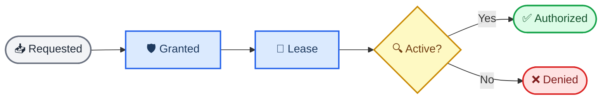

# Anyway capability policy

_Kernel-owned authorization model for the Host Bus and Inside RPC gateway._

---

## 📋 Policy purpose

`src-tauri/src/kernel/policy.rs` is the pure Rust authorization layer between a transport-bound caller and the Host Bus. It does not inspect Tauri windows, spawn processes, or move Blob bytes. Its only authority is to resolve an operation requirement and decide whether the caller has an explicit active proof.

The policy keeps the native UI fast while preserving a hard boundary for extensions:

| Caller | Proof accepted | Lifetime | Revocable |
| --- | --- | --- | --- |
| Native UI principal | Explicit bootstrap grant | Kernel policy lifetime | Policy-owned |
| Plugin principal | Selected `CapabilityLease` | Bounded epoch interval | Yes |
| Unknown principal | No implicit proof | None | Not applicable |

## 🔄 Four authorization stages

The four stages are intentionally different objects. A request expresses intent, a grant is kernel approval, a lease is the transport-selectable credential, and active authorization is the result of checking the lease at one epoch.

### Requested

`CapabilityPolicy::request(operation, principal, capability, scope, requested_expires_at)` validates the operation contract. The caller cannot request a different capability, and it cannot request a scope broader than the operation's required scope. The returned `CapabilityRequest` has no authority by itself.

### Granted

`CapabilityPolicy::grant(kernel_principal, request, granted_scope, max_expires_at, issued_at)` is kernel-only. The grant can narrow the request's scope and expiry, but cannot expand either. A non-native principal must receive a finite maximum expiry.

### Lease

`CapabilityPolicy::issue_lease(kernel_principal, grant, lease_id, issued_at, expires_at)` materializes the grant into the shared policy ledger. The lease inherits capability, principal, and scope from the grant; the caller cannot replace them. Its expiry must be finite for plugin principals and cannot exceed the grant maximum. The ledger supports kernel-only revocation through `revoke_lease`.

### Active

`CapabilityPolicy::authorize(operation, principal, selected_lease_ids, epoch)` performs the final check. It validates the operation mapping, the caller/lease principal equality, lease activation interval, revocation state, capability, and scope. Authorization returns an `Authorization` proof tagged as either `AuthorizationSource::NativeBootstrap` or `AuthorizationSource::Lease(lease_id)`.

## 🔐 Operation and principal rules

### Operation mapping

The policy maps operations to the single capability and scope checked by the kernel. All initial operation scopes are `CapabilityScope::Global`; callers can request narrower `Resource` scopes, and future policy entries can introduce resource-specific requirements.

| Operation | Required capability | Required scope |
| --- | --- | --- |
| `plugin.catalog.read` | `Custom("plugin.catalog.read")` | `Global` |
| `plugin.list` | `Custom("plugin.catalog.read")` | `Global` |
| `blob.read` / `blob.write` | `BlobRead` / `BlobWrite` | `Global` |
| `rpc.invoke` | `RpcInvoke` | `Global` |
| `graph.read` / `graph.patch.propose` | `GraphRead` / `GraphPatchPropose` | `Global` |
| `ui.register` / `worker.spawn` | `UiRegister` / `WorkerSpawn` | `Global` |
| `network.request` / `filesystem.*` / `process.spawn` | Matching kernel capability | `Global` |

`plugin.list` is a compatibility alias for `plugin.catalog.read`; it does not create a second capability. Unknown operations fail closed with `PolicyError::UnknownOperation`.

### Native bootstrap

`CapabilityPolicy::new()` creates the canonical `kernel` and `native.ui` principals. The policy installs explicit bootstrap grants for catalog read, Blob read, graph read, UI registration, and RPC invocation. The catalog grant uses `Capability::Custom("plugin.catalog.read")`, so this extension-specific authority remains visible in the same capability vocabulary as built-in capabilities.

The gateway may use `CapabilityPolicy::with_principals` when the transport binds a native UI principal to a window or webview session. Bootstrap authorization is exact-principal matching; no arbitrary `native.*` string is trusted by convention.

### Plugin leases

An extension cannot authorize itself by naming a capability. The issuer passed to `request`, `grant`, `issue_lease`, and `revoke_lease` is checked against the policy's kernel principal where authority is created or changed. Plugins must use selected lease IDs, and every plugin lease has an expiry and can be revoked by the kernel.

Scope attenuation follows two rules:

- `Global` may cover a narrower `Resource` request
- A `Resource` grant may cover only the same resource; it cannot cover `Global`

Expiry attenuation follows the same direction: a lease may end earlier than its grant maximum, but never later. Capability attenuation is structural because `CapabilityGrant` and `CapabilityLease` inherit the capability selected by the operation request; there is no public API that lets a caller substitute a broader capability while issuing a lease.

## ⚙️ API surface

| API | Purpose | Authority requirement |
| --- | --- | --- |
| `operation_requirement` | Resolve operation to capability/scope | None; unknown fails closed |
| `request` | Build the requested stage | Caller supplies intent only |
| `grant` | Attenuate request into a grant | `issuer == kernel` |
| `issue_lease` | Register a revocable lease | `issuer == kernel` |
| `revoke_lease` | Monotonically revoke a lease | `issuer == kernel` |
| `authorize` | Check active proof at `epoch` | Caller and lease must match |

The Gateway can therefore keep its transport request small: operation, selected lease IDs, and the kernel epoch are sufficient for authorization. Principal identity must come from the transport-bound session; if a request DTO also contains a caller-supplied principal, the Gateway should reject it before reaching this API.

## 🚫 Stable denial behavior

The policy exposes `PolicyError` for deterministic Gateway and audit mapping. Important distinctions are preserved: `LeaseRequired` means a plugin supplied no lease, `LeasePrincipalMismatch` means the selected lease belongs to another caller, `LeaseInactive` covers expiry or revocation, and `CapabilityDenied` means an active proof does not cover the required operation.

No policy error grants a fallback capability. The Host Bus must treat every error as a denied operation and must not retry with a caller-supplied principal or a wider scope.

## 🧪 Test coverage

The module's unit tests cover:

- Native bootstrap authorization for `plugin.catalog.read`
- Plugin denial without an explicit lease
- Caller/lease principal mismatch
- Expired and revoked lease denial
- Unknown operation rejection
- Capability, scope, and expiry expansion rejection
- Kernel-only issuance and revocation
- Mandatory finite expiry for plugin leases

The policy is pure state and is intended to be wired into the Tauri Gateway and Host Bus as a managed kernel component. Transport authentication, process sandboxing, and OS-level quotas remain separate enforcement layers.
