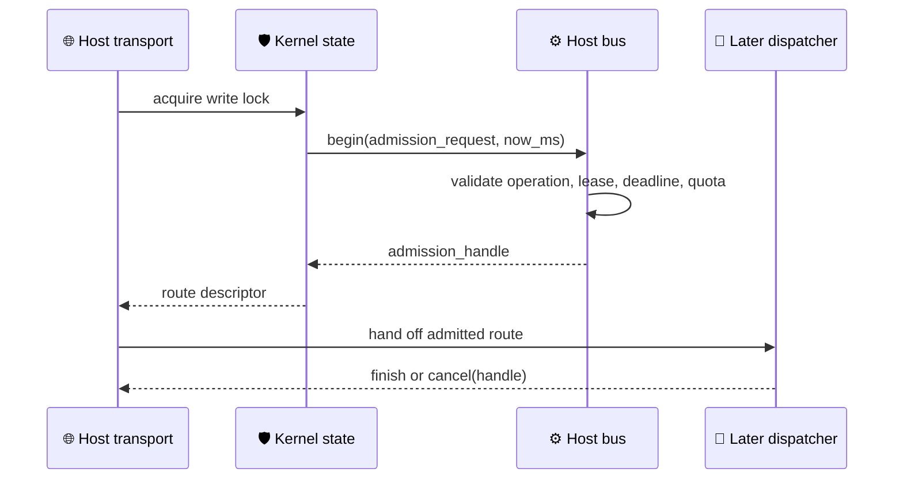

# Host Bus runtime model

_Phase 2 kernel runtime contract for admission and routing state; it is independent of Tauri and does not execute handlers._

---

## 🎯 Scope and invariants

The `HostBus` is the kernel-side admission boundary shared by native Anyway calls and future plugin calls. It accepts a transport-bound `PrincipalId`, an operation name, an absolute `Deadline`, a kernel-issued `CapabilityLease`, and a control-plane `BusPayload`.

The bus owns these invariants:

- Operation names must be registered before admission.
- A `RequestId` is single-use for the lifetime of the in-memory ledger.
- Each principal has a bounded number of pending calls; an operation may impose a tighter per-principal limit.
- The lease must belong to the attributed principal, be active at the supplied deterministic clock value, and cover the operation capability and scope.
- A pending call can finish once or be cancelled once. Deadline cancellation releases the same quota as explicit cancellation.
- Terminal request tombstones are bounded; write routes require a separate durable idempotency record before this recent-request window can be treated as replay protection.
- `BusPayload` contains metadata or `BlobRef`; it has no raw-byte variant.

## 🔗 Runtime boundary

The bus describes a route for the next dispatcher stage. It does not load a plugin, create a process, invoke a service, read a blob, or run a handler.

## ⚙️ Core API

| Type or function | Responsibility |
| --- | --- |
| `HostBus` | Owns operation registry, call ledger, and quota counters |
| `OperationDescriptor` | Maps an `OperationId` to `RpcTarget` and required capability scope |
| `AdmissionRequest` | Carries the already-bound principal, deadline, lease, and metadata/blob payload description |
| `HostBus::begin` | Performs admission and returns an opaque `AdmissionHandle` |
| `HostBus::finish` | Marks a pending call finished and releases quota |
| `HostBus::cancel` | Marks a pending call cancelled and releases quota |
| `HostBus::cancel_expired` | Applies deterministic-clock deadline cancellation |
| `HostBusConfig` | Bounds per-principal inflight work and retained terminal request tombstones |
| `KernelState` | Wraps `HostBus` in `Arc<RwLock<_>>` for managed application state |

`deadline_from_relative(now_ms, relative_deadline_ms)` converts transport-relative timeouts to the absolute `Deadline` used by the bus. The caller supplies `now_ms`, so tests and transports can use one explicit monotonic clock model without putting a clock implementation inside the bus.

## 🔐 Identity and payload rules

The request constructor exposes the principal because the pure model must represent a request, but the transport adapter is responsible for binding that value from its authenticated channel. The request has no field for an untrusted caller-supplied transport identity, and the bus rejects any lease whose principal does not match the attributed principal.

`Metadata` is a bounded map of scalar text values. Binary content, large JSON documents, and stream data are represented by `BlobRef` and are handled by the Blob Store path. This keeps control-plane admission small and makes IPC cost explicit.

## ✅ Verification expectations

The module contains unit tests for registration, unknown and duplicate requests, deadline expiry and overflow, capability checks, per-principal quota, route lookup, lifecycle transitions, cancellation, shared state, and the absence of a raw-byte `BusPayload` variant.

The module is now wired through `kernel/mod.rs` and managed by the Tauri Gateway, while remaining free of Tauri dependencies itself. The Phase 2 integration run passed the complete Rust test suite after route registration and Gateway admission were added.
