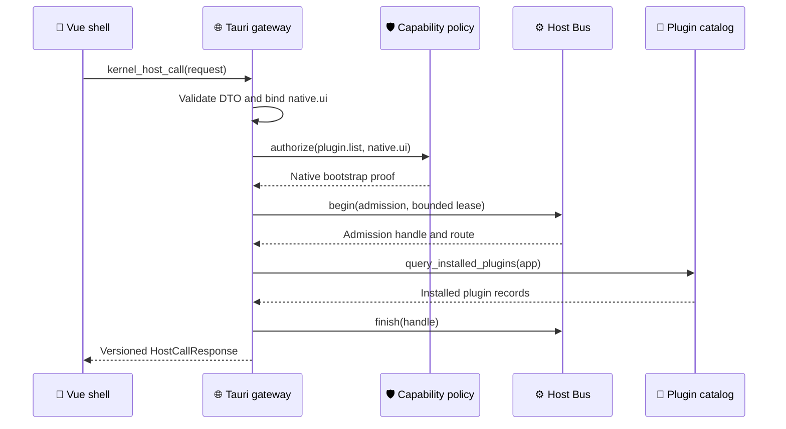

# Tauri Host SDK gateway

_Phase 2 implementation record for the first Vue-to-Kernel Host Bus vertical slice._

---

## 🎯 Delivered boundary

The Vue plugin catalog now calls `HostSdk.call("plugin.list", {})`. The SDK sends one versioned envelope through the single `kernel_host_call` Tauri command. Rust validates the envelope, binds `native.ui` from the invoking `main` WebView, authorizes the operation, admits it to the Host Bus, invokes a read-only catalog query, and finishes the Bus handle before returning the response.

The `list_installed_plugins` direct command was retired in Phase 8 once every frontend caller had migrated to the Host SDK. The read-only `plugin.list` operation and the internal catalog query are the only remaining catalog paths; the `list_installed_plugins` Rust function is retained solely for the internal LLM-provider registry.

## 🔗 Current data flow

The native bootstrap proof is not passed directly to the Bus. The Gateway materializes it as a lease that expires at the request deadline, so Policy and Bus enforce the same principal, capability, scope, and time boundary. A future plugin transport will select a stored lease from the policy ledger instead.

## 🔐 Enforced properties

| Property | Enforcement point |
| --- | --- |
| No caller-supplied principal | `HostCallRequest` has no principal and rejects unknown fields |
| Trusted native identity | Only the `main` WebView binds to `native.ui` |
| Version and size bounds | Gateway DTO validation before authorization |
| Explicit capability | `plugin.list` requires `plugin.catalog.read` |
| Bounded concurrency | Host Bus global and operation-level per-principal limits |
| Single-use request | Stable request ID hashing into the Bus ledger |
| Deadline-bounded authority | Native bootstrap lease expires with the call deadline |
| Stable deadline clock | Gateway derives deadlines from a process-monotonic clock |
| Stable failures | Versioned Host error codes for denial, overload, deadline, routing, and handler errors |

Malformed requests that contain `principal` fail during strict Serde deserialization and never reach authorization. Requests from a future non-`main` WebView receive `HOST_TRANSPORT_DENIED` until that transport has an explicit principal and policy entry.

## ⚙️ Implementation map

| Location | Responsibility |
| --- | --- |
| `app/platform/host-sdk.ts` | Versioned request/response envelope and inline limit |
| `app/platform/host-sdk-tauri.ts` | Lazy Tauri transport, cancellation, and one command name |
| `app/plugins/tauri-client.ts` | Migrated `plugin.list` caller |
| `src-tauri/src/kernel_commands.rs` | Strict DTO, transport identity, Policy/Bus integration, and dispatch |
| `src-tauri/src/kernel/policy.rs` | Operation requirement and active authorization proof |
| `src-tauri/src/kernel/bus.rs` | Admission ledger, routing metadata, deadlines, and quotas |
| `src-tauri/src/plugins.rs` | Read-only catalog query behind the Gateway |

## 🚧 Deliberate limits

This slice does not yet migrate plugin installation, settings writes, PDF jobs, WASM execution, or workspace operations. Pending package discovery still runs as a legacy kernel-startup compatibility action rather than under the `plugin.list` capability; it must move to the Package Trust/AnMarket activation transaction later. The legacy `list_installed_plugins` command also retains its original discovery behavior for rollback, while the Host SDK route is read-only.

The slice also does not claim that a Tauri WebView is a sandbox for community code: community UI continues to use validated Vue UI IR, while plugin workers will receive separate authenticated transports and explicit expiring leases.

Blob payloads are accepted by the public Host SDK contract but are not dispatched by this first route. The next data-path slice must resolve them through the kernel Blob Store rather than adapting their bytes back into JSON. `traceParent` is bounded and validated but is not yet persisted to the kernel audit ledger; audit integration remains mandatory before state-changing routes migrate.

## ✅ Verification

The vertical slice is covered by Rust tests for strict DTO validation, principal spoof rejection, request hashing, route registration, bounded bootstrap leases, Policy authorization, and Bus admission. TypeScript tests cover the Tauri command shape, principal-free envelope, non-Tauri failure, and local cancellation behavior.
