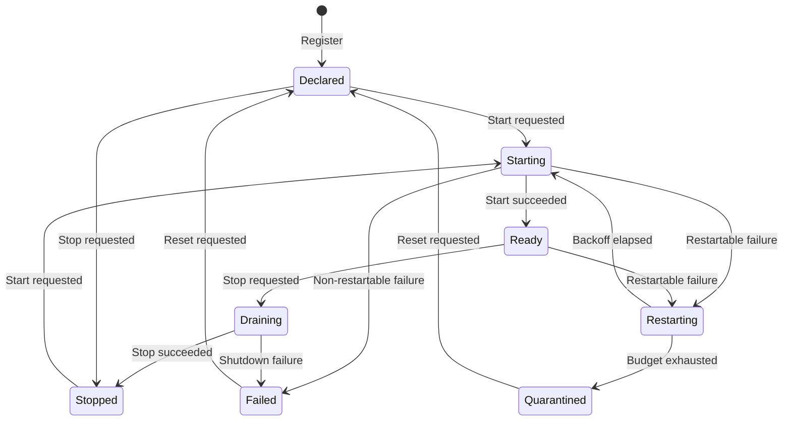
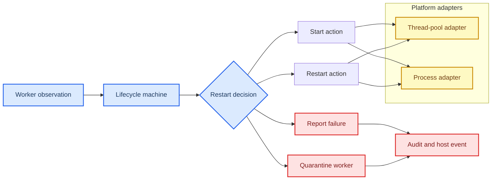

# Anyway kernel identity and lifecycle architecture

_First-phase design baseline: `ae47fe6` · scope: identity, capabilities, worker supervision, and lifecycle planning_

---

## 📋 Scope and current baseline

This document specifies the first kernel-facing vocabulary for Anyway. It is intentionally a **pure Rust model**: the new files define identities, capability leases, lifecycle transitions, and supervisor actions, but do not yet wire a runtime into Tauri.

The `ae47fe6` baseline already has several useful boundaries:

| Existing area | Current behavior | First-phase relation |
| --- | --- | --- |
| `AgentHostState` | Holds an `AgentHost` and one Tokio permit; batches are serialized | Future worker declarations can replace the global serialization point with scoped pool capacity |
| `AgentHost::JobState` | Owns the PDF/document pipeline state machine | Remains domain-specific; kernel lifecycle supervises its worker incarnation |
| `plugin_vm` | Runs capability-free WASM with no host imports and bounded fuel/memory | Becomes one execution adapter, not the universal supervisor |
| `plugins` | Validates capability declarations, payload hashes, and Ed25519 signatures | Kernel leases provide runtime attribution; existing package verification remains the install boundary |
| `workspace_host` | Performs host-mediated filesystem and Git actions | Future calls must carry a `PrincipalId` and be checked by the kernel bus |

The code is not exported from `lib.rs` in this phase. That is deliberate: module wiring, RPC transport, actual pools, and process creation are follow-up migration work outside this subtask.

## 🎯 Design goals and non-goals

### Goals

- Give every host actor, plugin incarnation, and worker a stable typed identity
- Represent capabilities as explicit, scoped, revocable leases rather than ambient permission
- Describe lifecycle transitions declaratively and make invalid transitions observable
- Use one supervisor registry for thread-pool tasks and external processes
- Preserve failure-domain differences so a shared pool is not mistaken for a process boundary
- Return typed actions so platform adapters can remain small and testable
- Make restart budgets, backoff, health reset, and quarantine deterministic

### Non-goals

- Starting or stopping real threads or processes
- Implementing Tokio, Rayon, OS job objects, cgroups, seccomp, WASI, or another OS sandbox
- Implementing inside RPC framing, Blob storage, Vue IR rendering, AnCordis, or AnMarket
- Replacing the existing plugin manifest, signature, or document job state machines

> ⚠️ **Security boundary:** `ExternalProcess` describes a planned failure domain only. It does not prove that a process is isolated, authenticated, or OS-sandboxed. The kernel adapter must add those controls before untrusted code is allowed to run.

## 🏗️ Identity and capability model

### Principal identity

`PrincipalId` identifies the security actor whose capability lease is checked. A plugin package ID and a running plugin instance are not interchangeable:

- `PrincipalId` identifies the policy subject, such as `plugin.anmarket`
- `PluginInstanceId` adds an incarnation nonce, such as `plugin.anmarket#instance-7`
- `WorkerId` identifies the supervisor record and is unique within one supervisor

The separation prevents a restart from inheriting stale in-flight state while keeping publisher and plugin policy stable. A request should carry both the principal and instance where audit and cancellation need incarnation precision.

### Capability and lease

`Capability` is a typed name with a controlled `Custom(String)` escape hatch for future providers. It is not authorization by itself. `CapabilityLease` binds one capability to:

- one `PrincipalId`
- one `CapabilityScope` (`Global` or a named resource)
- an issuance epoch and optional exclusive expiry epoch
- a revocation point

The `covers` check requires exact principal and capability equality. A global lease may cover a resource request; a resource lease may not escalate to global scope. Epochs are logical kernel epochs, not wall-clock timestamps, so the pure model is deterministic and easy to replay in tests.

## 🔄 Lifecycle state machine

The lifecycle declaration is carried by `LifecycleSpec`. It includes the desired state, startup/shutdown/heartbeat budgets, restart triggers, maximum restart attempts, backoff, and exhaustion action. The machine emits a `LifecycleTransition` with a `RestartDecision`; the supervisor maps that decision to a platform action.

The state machine is intentionally strict. For example, `StartSucceeded` cannot move a `Declared` worker directly to `Ready`, and a failure while draining never consumes restart budget. These rules prevent an adapter from accidentally reporting an old process incarnation as healthy.

### Restart policy

The conservative default is:

| Failure | Default action |
| --- | --- |
| Crash | Exponential restart, up to three attempts |
| Startup timeout | Exponential restart |
| Heartbeat timeout | Exponential restart |
| Protocol violation | Fail and report |
| Resource exhaustion | Fail and report |
| Shutdown timeout | Fail and report |
| Restart budget exhausted | Quarantine |

After the configured stable-health interval, the restart budget resets. A platform adapter may use real durations, but the state machine only receives logical tick counts so policy decisions remain deterministic.

## 🛡️ Supervisor abstraction

`Supervisor` owns a registry of `WorkerSpec` and `LifecycleMachine`. It does not own raw thread handles or child-process handles yet. It accepts observations and emits `SupervisorAction` values:

### Failure domains

| Worker kind | Failure domain | Meaning for supervision |
| --- | --- | --- |
| `ThreadPool { pool }` | `SharedThreadPool` | A panic, executor poisoning, or resource pressure can affect sibling tasks in the same host/pool; restart should be bounded and pool health should be monitored separately |
| `ExternalProcess { executable }` | `ExternalProcess` | A process exit can normally be restarted independently, but the adapter must still authenticate the child and enforce resource, filesystem, network, and executable policy |

The two kinds intentionally share identity, lifecycle, observations, and actions. They differ only where the supervisor needs to reason about blast radius and where a platform adapter will execute the action. This avoids duplicating policy while preventing a “process” enum value from being mistaken for an implemented sandbox.

## 📐 Security invariants

The following invariants are required before the kernel bus is connected to real workers:

1. Every RPC request, Blob operation, GraphPatch proposal, and UI registration is attributed to a `PrincipalId`; worker and plugin instance IDs are included when the operation is incarnation-sensitive
2. A capability name never grants access without an active `CapabilityLease`
3. A lease cannot be used before issuance, after exclusive expiry, after revocation, by another principal, or outside its resource scope
4. A child process or thread must not inherit the parent’s capability set implicitly; the kernel issues a new lease set for the child principal
5. The AnCordis process cannot replace kernel trust roots, lease validation, quarantine, or audit sinks through ordinary plugin registration
6. A `Restart` action never reuses a prior plugin instance ID; the process adapter must create a new incarnation before it reports `StartSucceeded`
7. Protocol violations and exhausted restart budgets are fail-closed by default; quarantine is visible to the host and cannot be silently converted to `Ready`
8. A `SharedThreadPool` worker is not treated as an OS isolation boundary
9. An `ExternalProcess` worker is not treated as sandboxed until a platform adapter proves the sandbox and resource policy
10. Lifecycle and supervisor state transitions are deterministic and auditable; side-effect adapters cannot invent an unmodeled state

## 🔌 Inside RPC and Blob handoff boundary

Inside RPC and Blob are intentionally not implemented in these files, but their boundary is constrained by the types above:

- RPC envelopes carry `principal`, `plugin_instance`, `worker_id`, method, schema version, request ID, and capability proof/lease reference
- Small control messages travel through the host bus; large payloads travel as immutable Blob references with size, digest, media type, and owner metadata
- A Blob reference is data, not authority: every read still checks the caller’s active lease and resource scope
- The supervisor owns worker liveness and cancellation; the RPC layer owns correlation and protocol validation
- A malformed envelope or lease mismatch becomes `ProtocolViolation`, which the conservative policy does not automatically restart

This separation keeps IPC overhead low without turning a high-throughput Blob path into an authorization bypass. The eventual transport can use channels for in-process tasks and framed IPC for external workers while presenting the same host SDK surface.

## 🎨 Vue IR, AnCordis, and AnMarket placement

These are later layers, not implemented by the first-phase Rust files:

| Layer | Planned responsibility | Kernel relationship |
| --- | --- | --- |
| Vue IR | Allowlisted component tree, typed props/events, host-owned mounting and parsing | UI registration requires `ui.register`; arbitrary HTML and direct DOM access stay outside the contract |
| AnCordis | Official non-kernel extension host for Cordis services, events, and reversible effects | Runs as a supervised principal; plugin registration does not bypass kernel leases |
| AnMarket | Registry, package metadata, signatures, payload hashes, scanners, reputation, and update UX | Kernel retains trust roots, staging, atomic activation, rollback, and final capability grant |

AnCordis may host trusted official services in one process, but untrusted or community Cordis code must use a separate worker principal and host RPC. AnMarket can be extensible for scanners and registries, but it cannot be allowed to modify trust roots or approve its own installation.

## 🚚 Migration path from `ae47fe6`

### Phase 1 — current change

- Add `kernel::identity` pure types and unit tests
- Add `kernel::lifecycle` declarative state machine and restart policy tests
- Add `kernel::supervisor` registry, failure domains, typed actions, and tests
- Add this architecture contract
- Keep `lib.rs`, dependency declarations, current job state, and runtime behavior unchanged

### Phase 2 — module and adapter wiring

- Export `kernel` from `lib.rs`
- Convert existing plugin IDs and job IDs at API boundaries into typed identities
- Add a kernel-owned capability ledger and audit event stream
- Wrap the current serial AgentHost permit in a named thread-pool worker declaration
- Preserve existing `AgentHost::JobState` inside the worker; report only lifecycle observations to the kernel supervisor

### Phase 3 — Host Bus, Blob, and inside RPC

- Define versioned RPC envelopes and error codes
- Add immutable Blob metadata and streaming transport
- Add lease checks before every file, graph, network, credential, and Blob operation
- Add protocol violation handling and per-principal quotas

### Phase 4 — AnCordis and Vue IR

- Run AnCordis as a non-kernel supervised process or explicitly trusted host process
- Give each child plugin a distinct principal and instance ID
- Expose Cordis services only as RPC-backed capability providers for untrusted plugins
- Register Vue IR contributions through a schema validator and host-owned renderer

### Phase 5 — AnMarket and platform enforcement

- Move package staging, signature verification, payload hash verification, and rollback under kernel control
- Add scanner/reputation providers as restricted AnMarket workers
- Add platform-specific process resource limits and OS sandboxing
- Only after those adapters exist, document `ExternalProcess` as an enforced security boundary

## 🧪 Verification strategy

The Rust files include unit tests for:

- identity validation and typed display
- capability name round trips and scoped lease matching
- expiry and revocation
- valid and invalid lifecycle transitions
- exponential backoff and quarantine after exhaustion
- health-based restart budget reset
- shared thread-pool versus external-process failure domains
- supervisor action mapping and duplicate/unknown worker errors

At this phase the tests are pure-model tests. Because `lib.rs` is intentionally unchanged, the new module is not yet part of the normal crate graph; integration and platform-adapter tests belong to Phase 2.

## 🔗 References

- [Existing AgentHost job lifecycle](../../src-tauri/src/agent_host.rs)
- [Existing serialized AgentHost command gate](../../src-tauri/src/agent_commands.rs)
- [Existing capability-free WASM execution](../../src-tauri/src/plugin_vm.rs)
- [Existing plugin manifest validation and payload hashing](../../src-tauri/src/plugins.rs)
- [Existing Ed25519 trust-root verification](../../src-tauri/src/signing.rs)
