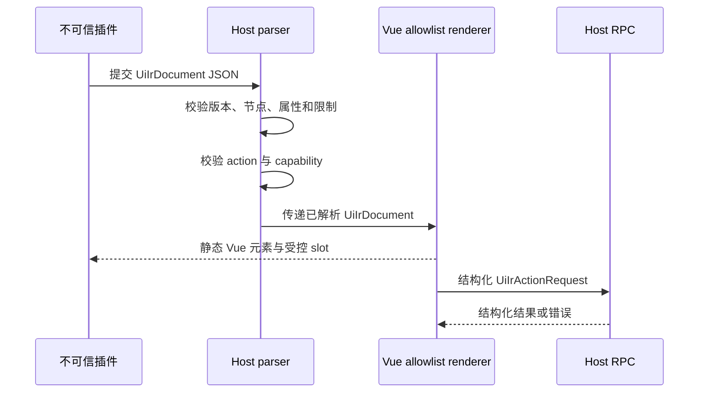

# 安全 Vue UI IR

_Anyway 第一阶段 UI 扩展契约：在保留可信原生 Vue 开发体验的同时，为不可信插件提供可审计的声明式界面边界。_

---

## 🎯 设计目标

UI 扩展采用双轨模型：可信的 Anyway 原生代码和已信任插件可以使用完整 Vue SFC、`slot`、composable 和现有状态层；不可信插件只能提交版本化 JSON UI IR，由 Host 解析、授权并交给 allowlist renderer 渲染。

这两个轨道共享 Host 的状态和 RPC 语义，但不共享代码执行权限。IR 不会被编译成 Vue 模板，也不会让插件提供组件名、事件函数、任意表达式或 HTML 字符串。当前 `anPdfsolver` 走可信 `frontend.mode="trusted-module"` 轨道：源码是 `my-plugins/anPdfsolver/frontend/src/*.vue` 和 TypeScript，构建产物是 `dist/frontend.mjs`，不是 JSON UI IR。



## 📋 版本化 IR 契约

契约位于 [`app/plugins/ui-ir.ts`](../../app/plugins/ui-ir.ts)，当前版本为 `anyway.dev/ui-ir/v1`。根对象只接受以下属性：

| 属性 | 类型 | 说明 |
| --- | --- | --- |
| `apiVersion` | 固定字符串 | 必须精确匹配当前版本 |
| `root` | `UiIrNode` | 一个可渲染根节点 |
| `bindings` | `UiIrBinding[]` | 可选的状态/动作声明，供工具和 Host 预检 |

`UiIrNode`、`UiIrBinding` 和 `UiIrActionRequest` 都使用 `type` 判别联合。第一阶段的最小节点集合如下：

| 节点或绑定 | 作用 | 允许的动态输入 |
| --- | --- | --- |
| `slot` | 进入 Host 预留的命名位置 | slot 名称和子节点 |
| `stack` | 行/列布局 | `direction`、有限数值 `gap` |
| `grid` | 网格布局 | 1–12 列和有限数值 `gap` |
| `text` | 文本节点 | 字符串或 `state-binding` |
| `button` | 提交 Host action | `action-binding`、受控禁用状态 |
| `input` | 文本输入 | `state-binding`、结构化 change action |
| `select` | 固定选项选择 | 固定选项、`state-binding`、结构化 change action |
| `list` | 静态或状态列表 | 受限列表项或 `state-binding` |
| `state-binding` | 读取/写入状态路径 | 仅点分路径，不是表达式 |
| `action-binding` | 指向 Host action | action ID、capability、JSON 参数 |

绑定不是函数。`state-binding.path` 只允许安全的点分标识符，例如 `settings.model`；`action-binding` 只保存稳定的 `actionId`、`capability` 和 JSON 参数。

## 🛡️ 解析和授权边界

解析器位于 [`src/vue/runtime/vue-ir/parser.ts`](../../src/vue/runtime/vue-ir/parser.ts)，入口是 `parseUiIR(input, options)`。它把 `unknown` 转换成已检查的 `UiIrDocument`；任何一步失败都抛出带 `code` 和 `path` 的 `UiIrValidationError`。

默认限制如下，Host 可以在更严格方向覆盖：

| 限制 | 默认值 | 目的 |
| --- | ---: | --- |
| 最大递归深度 | 16 | 防止恶意嵌套耗尽调用栈 |
| 最大节点数 | 256 | 限制单个插件的渲染规模 |
| 最大字符串长度 | 512 | 限制标签、路径和参数体积 |
| 最大数组长度 | 128 | 限制 children、options 和 list |
| 最大对象属性数 | 16 | 限制单个 IR 对象的结构复杂度 |

每类节点都有独立属性白名单。未识别的 `html`、`rawHtml`、`component`、`expression`、`script`、`style`、`onClick` 等属性会被拒绝；未知节点类型也会被拒绝。因此“文本里出现 HTML 字符”仍然只是文本，不会被当作 markup 解释。

解析器还拒绝循环对象、函数、非有限数字、非普通对象、非法状态路径和保留路径段。`action-binding` 默认必须同时提供 action 与 capability allowlist；如果 Host 传入 action-capability 映射，还会校验二者的组合，而不是只分别检查字符串。

> ⚠️ **安全边界：** 解析通过只表示 IR 可以安全地描述界面，不表示插件获得了对应 capability。最终的 capability 授权仍属于 Rust Kernel/Host policy；renderer 不能绕过该策略。

## 🎨 Allowlist renderer 和 Vue 体验

renderer 位于 [`src/vue/runtime/vue-ir/renderer.ts`](../../src/vue/runtime/vue-ir/renderer.ts)。它只对已解析的判别联合做 `switch`，并直接使用固定的 `h("div")`、`h("button")`、`h("input")`、`h("select")`、`h("ul")` 等原生元素。它不使用动态组件名、模板编译、`v-html` 或来自 IR 的 style 字符串。

`UiIRRenderer` 是一个 Vue 组件，`provideUiIrRuntime`/`useUiIrRuntime` 是对应的 composable 边界：

- 可信原生 Vue 可以在 Host 内提供真实的 Vue slot 内容
- IR 的 `slot.name` 仍必须命中 `allowedSlots`
- slot 内容是 Host 提供的可信 VNode，插件只能请求位置，不能上传 VNode 或组件对象
- state reader、state writer 和 dispatcher 由 Host 注入，IR 本身不携带闭包
- 状态变化只写入指定 binding，不能提交事件对象或任意表达式

这保留了 Vue 的组合方式，但把“不可信插件能描述什么”和“可信 Host 能实现什么”分开。Vue 的 render function、slot 和 composable 语义可参考官方文档[^1]。

这里的 UI IR `slot` 只是声明式界面中的受控占位节点，不等同于 Host 的物理 Slot Catalog。Host 物理 slot 是可枚举放置点，例如 `workspace.toolbar.actions`、`workspace.dialogs`、`workspace.status`；插件内部 Vue 组件可以继续使用普通 Vue slots，但这些内部 slots 不会被称为 Host slot，也不会被 Host 枚举。

## 🔗 Host RPC action

按钮、输入和选择器的动作最终都转换为以下数据对象：

```typescript
type UiIrActionRequest = {
  apiVersion: "anyway.dev/ui-ir/v1";
  pluginId: string;
  actionId: string;
  capability: string;
  parameters: Record<string, string | number | boolean | null | UiIrJsonValue>;
};
```

renderer 使用 [`createUiIrActionRequest`](../../app/plugins/ui-ir.ts) 构造请求，并再次确认 plugin/action/capability 标识符和参数是结构化 JSON。DOM 事件函数只存在于可信 renderer 的闭包中，不会进入 IR，也不会跨过 Host RPC。

Host 接收到 action 后仍需执行自己的顺序：

1. 根据 `pluginId` 找到已安装版本和当前 principal
2. 根据 `actionId` 与 `capability` 做 manifest/policy 校验
3. 复制并限制参数，拒绝额外字段或超出 schema 的值
4. 将请求转给统一 Host SDK envelope
5. 返回结构化结果、稳定错误码和审计信息

第一阶段不改变既有 `contracts.ts`。`UiIrActionRequest` 进入统一 Host SDK envelope，而不是让 Vue runtime 直接调用 Tauri 或 Rust。

## 🧭 可信与不可信双轨

| 能力 | 可信原生 Vue | 不可信 UI IR |
| --- | --- | --- |
| 自定义 SFC | 允许；可信插件通过 `dist/frontend.mjs` 加载 | 不允许 |
| Vue slot | 完整 slot | 只请求 allowlisted slot |
| composable | 可直接使用 | 只能使用 Host 注入的 reader/writer/dispatcher |
| 动态组件 | 由代码审计后决定 | 禁止 |
| 任意 HTML/脚本 | 由受信代码边界负责 | 禁止 |
| 事件处理 | 可使用函数 | 只能声明 action binding |
| 文件、网络、进程 | 由 Host/Kernel policy 控制 | 只能通过 RPC capability |
| UI 结构 | 任意 Vue 组件树 | 固定 IR 节点集合 |

这不是把所有 Anyway UI 改成 IR。账户、设置、恢复、权限提示等核心界面仍可使用原生 Vue；可信插件也可以使用打包后的 Vue SFC 模块。只有第三方或未完全信任的插件界面进入 IR 轨道。`anPdfsolver` 当前不属于本页描述的 JSON UI IR 路径。

## 🧪 第一阶段测试

[`tests/vue-ui-ir.test.ts`](../../tests/vue-ui-ir.test.ts) 使用项目标准 `node:test` 和 `node:assert/strict` 覆盖：

- raw HTML、动态组件、表达式、脚本、style 字符串和事件函数注入
- 非法 state path 以及 action/capability allowlist 拒绝
- 深度、节点数、字符串长度和对象属性上限
- 最小节点集合的合法解析
- allowlist renderer 的静态元素和 slot 拒绝
- action RPC 只携带结构化参数

运行方式：

```text
npx tsx --test tests/vue-ui-ir.test.ts
```

SFC 编译阶段使用 `@vue/compiler-sfc`/`@vue/compiler-dom`；运行时不编译 SFC。

## 📍 当前边界

UI IR 契约、解析器、renderer 和局部测试保留为不可信插件兼容轨道；官方 `anPdfsolver` 不再通过该轨道承载界面：

- ✅ Host 物理 Slot Catalog 由 Host 自动枚举，`ResearchWorkspaceApp` 通过 `v-for` 和 `PluginContributionSlot` 渲染用户已启用插件的贡献。
- ✅ `anPdfsolver` manifest 使用 `frontend:{ mode:"trusted-module", entry:"dist/frontend.mjs", framework:"vue3", apiVersion:"1" }` 与 `contributes.ui[{ id, slotId, export, order?, when? }]`，插件前端拥有上传、批量、SSE、错误和 review UI。
- ✅ Host 不再导入 PDF agent 专属上传、审阅或 host-slot renderer；文件选择、设置、worker、GraphPatch 和 slots 能力通过 `PluginContext` 暴露，`PluginContext` 不暴露 raw Host SDK。
- ✅ UI IR 仍可用于不可信插件的声明式界面，但不得用于描述 `anPdfsolver` 当前路径。

## References

[^1]: Vue.js. (2025). "Render Functions & JSX; Slots; Composables." https://vuejs.org/guide/extras/render-function.html
